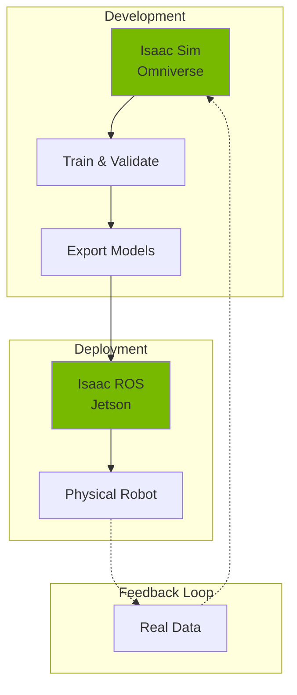
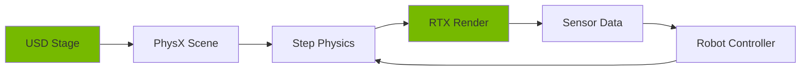
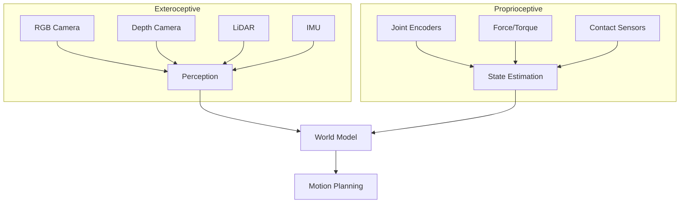
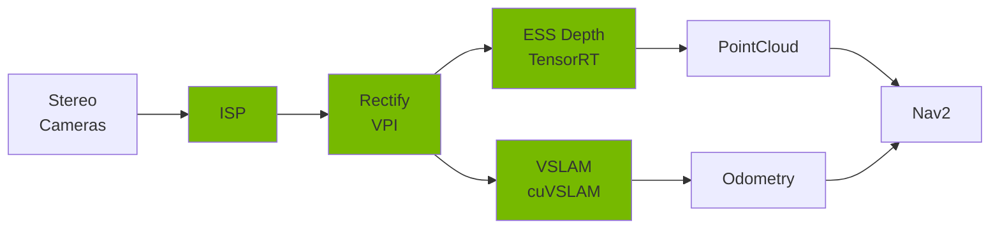
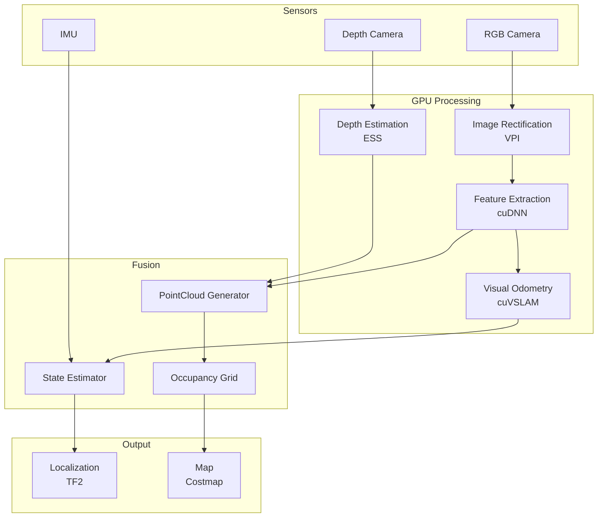
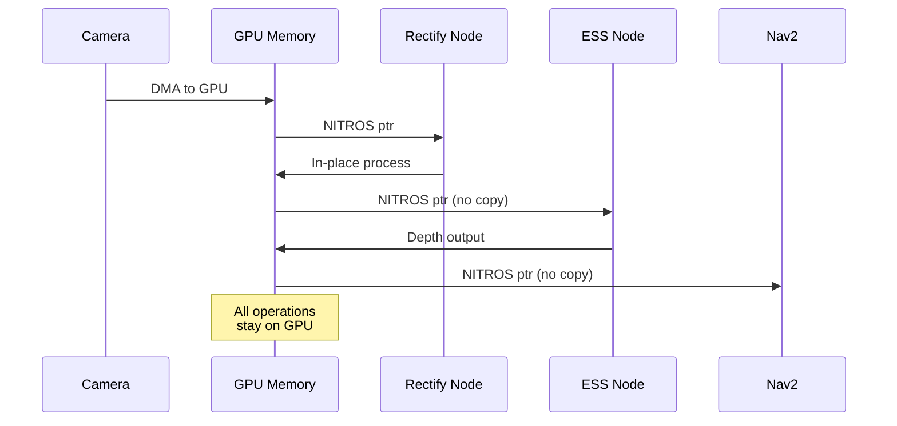
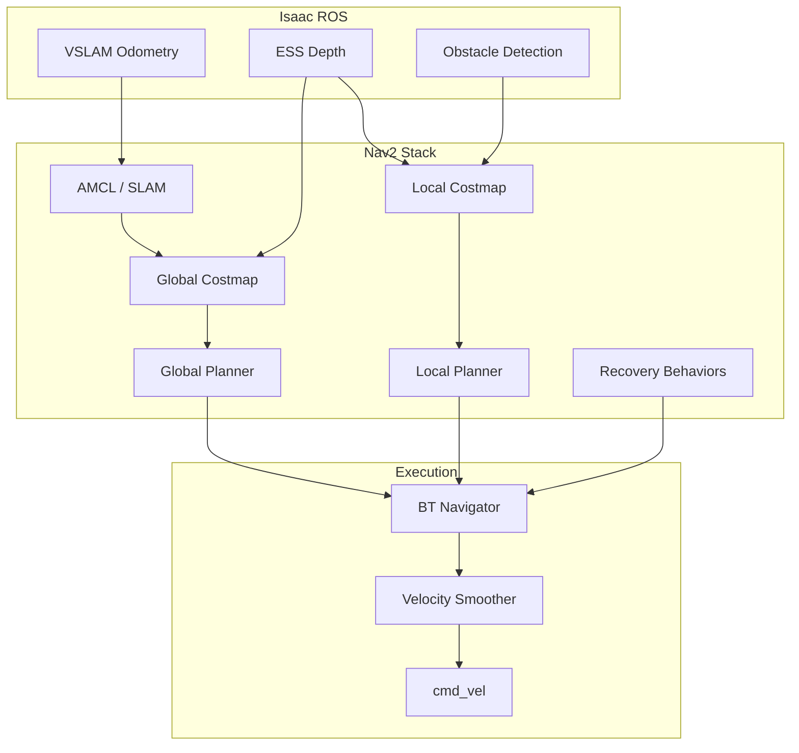
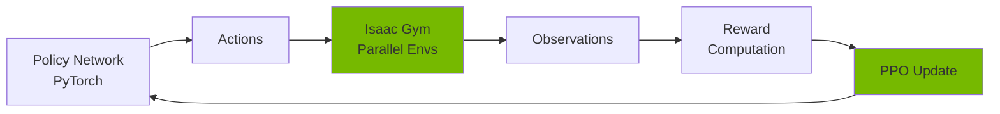
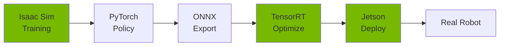
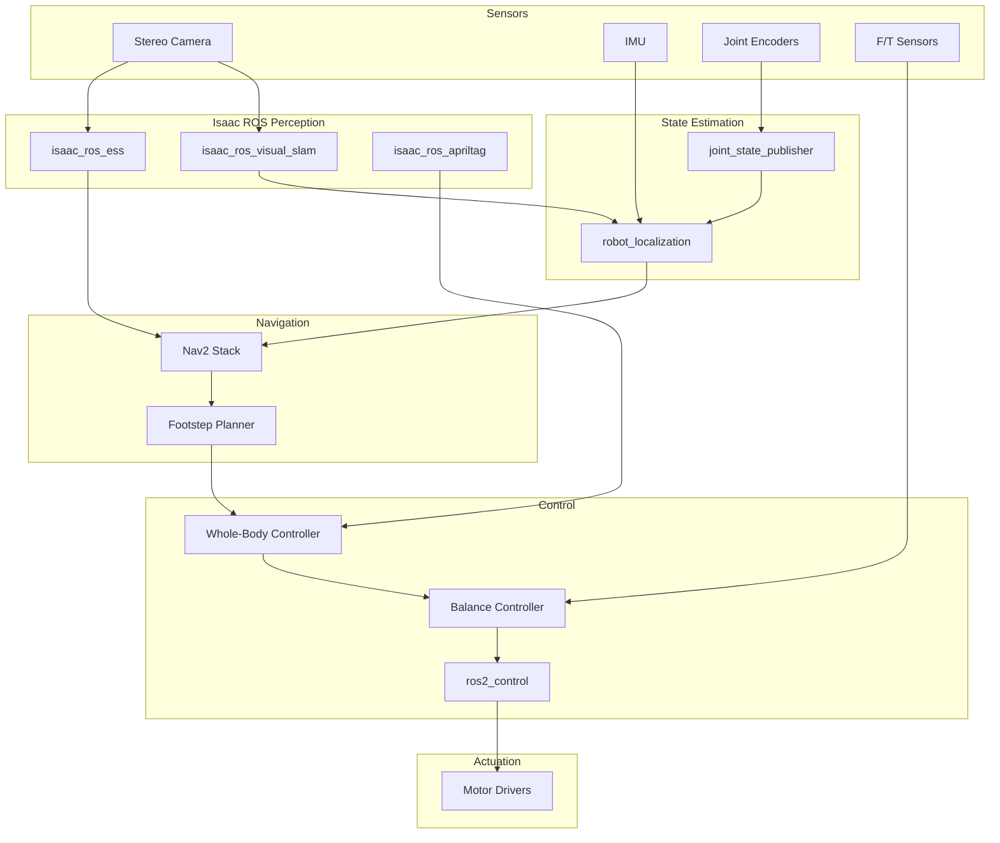

# Chapter 7: NVIDIA Isaac Platform — Perception, Simulation, Navigation & Sim-to-Real

> *"Simulation is the new compiler for robotics."*
> — Jensen Huang, NVIDIA CEO

---

## 1. Introduction

### What is the Isaac Platform?

NVIDIA Isaac is a comprehensive robotics platform comprising three interconnected components:

| Component | Purpose | Key Technologies |
|-----------|---------|------------------|
| **Isaac Sim** | High-fidelity physics simulation | Omniverse, USD, PhysX 5, RTX |
| **Isaac SDK** | Robot application framework | GXF, CUDA, TensorRT |
| **Isaac ROS** | GPU-accelerated ROS 2 packages | NITROS, cuDNN, VPI |

### Why Isaac Matters for Physical AI

1. **Photorealistic rendering** — RTX ray tracing generates synthetic training data indistinguishable from real
2. **Accurate physics** — PhysX 5 simulates contacts, deformables, fluids at real-time rates
3. **GPU-native perception** — 10-100× faster than CPU alternatives
4. **Seamless sim-to-real** — Same code runs in simulation and on Jetson hardware

### Architecture Overview



---

## 2. Isaac Sim Fundamentals

### Core Technologies

| Technology | Function |
|------------|----------|
| **USD (Universal Scene Description)** | Scene graph format from Pixar — composable, versionable, streamable |
| **PhysX 5** | GPU-accelerated rigid body, articulation, soft body physics |
| **RTX** | Real-time ray tracing for photorealistic rendering and sensor simulation |
| **Omniverse** | Collaboration platform connecting DCC tools, simulation, AI |

### Physics Settings Reference

| Parameter | Humanoid Default | Description |
|-----------|------------------|-------------|
| `time_steps_per_second` | 120-240 | Simulation frequency |
| `solver_position_iterations` | 8 | Contact solver passes |
| `solver_velocity_iterations` | 1 | Velocity solver passes |
| `enable_gpu_dynamics` | True | GPU physics acceleration |
| `enable_ccd` | True | Continuous collision detection |
| `gravity` | (0, 0, -9.81) | World gravity vector |

### Simulation Pipeline



### Example: Load USD Humanoid

```python
from omni.isaac.core import World
from omni.isaac.core.utils.stage import add_reference_to_stage
from omni.isaac.core.articulations import Articulation

# Initialize simulation world
world = World(stage_units_in_meters=1.0)
world.scene.add_default_ground_plane()

# Load humanoid from USD
humanoid_usd = "/Isaac/Robots/Humanoid/humanoid.usd"
humanoid_prim_path = "/World/Humanoid"

add_reference_to_stage(usd_path=humanoid_usd, prim_path=humanoid_prim_path)

# Create articulation handle
humanoid = world.scene.add(
    Articulation(
        prim_path=humanoid_prim_path,
        name="humanoid",
        position=[0, 0, 1.0]
    )
)

# Initialize and step
world.reset()
for _ in range(1000):
    world.step(render=True)
```

### Example: Spawn RTX Camera

```python
from omni.isaac.sensor import Camera
import numpy as np

# Create RGB-D camera with RTX rendering
camera = Camera(
    prim_path="/World/Humanoid/head/camera",
    name="head_camera",
    frequency=30,
    resolution=(1280, 720),
    position=[0.1, 0, 0.05],  # Relative to head
    orientation=[1, 0, 0, 0]  # Quaternion wxyz
)

# Enable depth output
camera.add_distance_to_camera_to_frame()
camera.add_instance_segmentation_to_frame()

# Initialize camera
camera.initialize()

# Capture frame
world.step(render=True)
frame = camera.get_current_frame()

rgb = frame["rgba"][:, :, :3]  # (H, W, 3)
depth = frame["distance_to_camera"]  # (H, W)
segmentation = frame["instance_segmentation"]  # (H, W)
```

### Sensor Types in Isaac Sim



---

## 3. Isaac ROS (GPU-Accelerated Perception)

### Key Packages

| Package | Function | GPU Acceleration |
|---------|----------|------------------|
| `isaac_ros_visual_slam` | Visual-inertial odometry | cuVSLAM |
| `isaac_ros_ess` | Stereo depth estimation | DNN-based ESS |
| `isaac_ros_apriltag` | Fiducial detection | CUDA kernels |
| `isaac_ros_dnn_inference` | TensorRT inference | TensorRT |
| `isaac_ros_nitros` | Zero-copy message passing | GPU memory |
| `isaac_ros_image_proc` | Image rectification | VPI |

### Jetson Perception Pipeline



### Launch File: Stereo Perception

```xml
<launch>
  <!-- Camera driver -->
  <include file="$(find-pkg-share isaac_ros_hawk)/launch/hawk.launch.py">
    <arg name="target_fps" value="30"/>
  </include>

  <!-- Stereo rectification (GPU) -->
  <node pkg="isaac_ros_image_proc" exec="rectify_node" name="rectify">
    <param name="output_width" value="1280"/>
    <param name="output_height" value="720"/>
  </node>

  <!-- ESS depth estimation (GPU) -->
  <node pkg="isaac_ros_ess" exec="ess_node" name="ess_depth">
    <param name="engine_file_path" value="/models/ess.engine"/>
    <param name="threshold" value="0.35"/>
    <remap from="left/image_rect" to="/hawk/left/image_rect"/>
    <remap from="right/image_rect" to="/hawk/right/image_rect"/>
  </node>

  <!-- Visual SLAM (GPU) -->
  <node pkg="isaac_ros_visual_slam" exec="visual_slam_node" name="vslam">
    <param name="enable_imu_fusion" value="true"/>
    <param name="gyro_noise_density" value="0.00018"/>
    <param name="accel_noise_density" value="0.003"/>
  </node>
</launch>
```

### Subscriber: Stereo Depth

```python
import rclpy
from rclpy.node import Node
from sensor_msgs.msg import Image
from cv_bridge import CvBridge
import numpy as np

class DepthSubscriber(Node):
    def __init__(self):
        super().__init__('depth_subscriber')
        self.bridge = CvBridge()

        # Subscribe to ESS depth output
        self.subscription = self.create_subscription(
            Image,
            '/ess/depth',
            self.depth_callback,
            10
        )

    def depth_callback(self, msg: Image):
        # Convert to numpy (float32 meters)
        depth = self.bridge.imgmsg_to_cv2(msg, desired_encoding='32FC1')

        # Filter valid depths
        valid_mask = (depth > 0.1) & (depth < 10.0)

        # Compute statistics
        mean_depth = np.mean(depth[valid_mask])
        self.get_logger().info(f'Mean depth: {mean_depth:.2f}m')

def main():
    rclpy.init()
    node = DepthSubscriber()
    rclpy.spin(node)
    rclpy.shutdown()

if __name__ == '__main__':
    main()
```

---

## 4. Perception Pipeline

### Full Pipeline Architecture



### CPU vs GPU Throughput Comparison

| Operation | CPU (i7) | GPU (Jetson Orin) | Speedup |
|-----------|----------|-------------------|---------|
| Stereo rectification | 45 ms | 2.1 ms | 21× |
| Depth estimation (ESS) | 890 ms | 28 ms | 32× |
| Visual SLAM | 67 ms | 8.5 ms | 8× |
| AprilTag detection | 23 ms | 1.8 ms | 13× |
| Object detection (YOLO) | 156 ms | 11 ms | 14× |
| PointCloud generation | 34 ms | 3.2 ms | 11× |

### NITROS Zero-Copy Pipeline



---

## 5. Navigation (Isaac + Nav2)

### Nav2 Integration Architecture



### Humanoid Navigation Constraints

| Constraint | Value | Rationale |
|------------|-------|-----------|
| Max velocity | 0.5 m/s | Balance stability |
| Max rotation | 0.8 rad/s | CoM limits |
| Footprint | Convex hull | Dynamic based on pose |
| Inflation radius | 0.4 m | Arm reach clearance |
| Min obstacle height | 0.05 m | Step-over capability |
| Max obstacle height | 0.15 m | Step-over limit |

### Nav2 Configuration (Humanoid)

```yaml
# nav2_params.yaml
bt_navigator:
  ros__parameters:
    default_nav_to_pose_bt_xml: "navigate_w_replanning.xml"
    plugin_lib_names:
      - nav2_compute_path_to_pose_action_bt_node
      - nav2_follow_path_action_bt_node
      - nav2_recovery_node_bt_node

controller_server:
  ros__parameters:
    controller_frequency: 20.0
    controller_plugins: ["FollowPath"]
    FollowPath:
      plugin: "dwb_core::DWBLocalPlanner"
      max_vel_x: 0.5
      min_vel_x: 0.0
      max_vel_theta: 0.8
      min_speed_theta: 0.1
      acc_lim_x: 0.3
      acc_lim_theta: 0.5
      decel_lim_x: -0.5
      decel_lim_theta: -0.8

local_costmap:
  local_costmap:
    ros__parameters:
      update_frequency: 10.0
      publish_frequency: 5.0
      width: 5
      height: 5
      resolution: 0.05
      robot_base_frame: base_link
      plugins: ["obstacle_layer", "inflation_layer"]
      obstacle_layer:
        plugin: "nav2_costmap_2d::ObstacleLayer"
        observation_sources: depth
        depth:
          topic: /ess/depth
          sensor_frame: camera_link
          data_type: PointCloud2
          min_obstacle_height: 0.05
          max_obstacle_height: 2.0
      inflation_layer:
        plugin: "nav2_costmap_2d::InflationLayer"
        inflation_radius: 0.4
        cost_scaling_factor: 3.0
```

### Goal Publisher Node

```python
import rclpy
from rclpy.node import Node
from rclpy.action import ActionClient
from nav2_msgs.action import NavigateToPose
from geometry_msgs.msg import PoseStamped
import tf_transformations

class GoalPublisher(Node):
    def __init__(self):
        super().__init__('goal_publisher')
        self._action_client = ActionClient(
            self,
            NavigateToPose,
            'navigate_to_pose'
        )

    def send_goal(self, x: float, y: float, yaw: float):
        """Send navigation goal to Nav2."""
        goal_msg = NavigateToPose.Goal()
        goal_msg.pose = PoseStamped()
        goal_msg.pose.header.frame_id = 'map'
        goal_msg.pose.header.stamp = self.get_clock().now().to_msg()

        # Position
        goal_msg.pose.pose.position.x = x
        goal_msg.pose.pose.position.y = y
        goal_msg.pose.pose.position.z = 0.0

        # Orientation from yaw
        q = tf_transformations.quaternion_from_euler(0, 0, yaw)
        goal_msg.pose.pose.orientation.x = q[0]
        goal_msg.pose.pose.orientation.y = q[1]
        goal_msg.pose.pose.orientation.z = q[2]
        goal_msg.pose.pose.orientation.w = q[3]

        self._action_client.wait_for_server()
        future = self._action_client.send_goal_async(
            goal_msg,
            feedback_callback=self.feedback_callback
        )
        future.add_done_callback(self.goal_response_callback)

    def feedback_callback(self, feedback_msg):
        distance = feedback_msg.feedback.distance_remaining
        self.get_logger().info(f'Distance remaining: {distance:.2f}m')

    def goal_response_callback(self, future):
        goal_handle = future.result()
        if not goal_handle.accepted:
            self.get_logger().error('Goal rejected')
            return
        self.get_logger().info('Goal accepted')
        goal_handle.get_result_async().add_done_callback(
            self.result_callback
        )

    def result_callback(self, future):
        result = future.result().result
        self.get_logger().info('Navigation complete')

def main():
    rclpy.init()
    node = GoalPublisher()
    node.send_goal(x=2.0, y=1.0, yaw=1.57)
    rclpy.spin(node)
    rclpy.shutdown()

if __name__ == '__main__':
    main()
```

---

## 6. Manipulation in Isaac Sim

### Articulation Control Modes

| Mode | Use Case | API |
|------|----------|-----|
| Position | Joint angle targets | `set_joint_positions()` |
| Velocity | Speed control | `set_joint_velocities()` |
| Effort | Torque/force control | `set_joint_efforts()` |
| Stiffness | Impedance control | `set_gains()` |

### Arm Control Example

```python
from omni.isaac.core.articulations import Articulation
from omni.isaac.core import World
import numpy as np

class HumanoidArmController:
    def __init__(self, humanoid: Articulation):
        self.robot = humanoid

        # Arm joint indices (right arm example)
        self.arm_joints = [
            "right_shoulder_pitch",
            "right_shoulder_roll",
            "right_shoulder_yaw",
            "right_elbow",
            "right_wrist_pitch",
            "right_wrist_roll"
        ]

        # Get joint indices
        self.joint_indices = [
            self.robot.get_dof_index(name)
            for name in self.arm_joints
        ]

    def set_arm_position(self, positions: np.ndarray):
        """Set arm joint positions (radians)."""
        current = self.robot.get_joint_positions()
        current[self.joint_indices] = positions
        self.robot.set_joint_positions(current)

    def set_arm_effort(self, torques: np.ndarray):
        """Set arm joint torques (Nm)."""
        current = np.zeros(self.robot.num_dof)
        current[self.joint_indices] = torques
        self.robot.set_joint_efforts(current)

    def get_end_effector_pose(self):
        """Get hand position and orientation."""
        # Use Jacobian for forward kinematics
        pose = self.robot.get_body_position("right_hand")
        orientation = self.robot.get_body_orientation("right_hand")
        return pose, orientation

    def impedance_control(
        self,
        target_pos: np.ndarray,
        kp: float = 100.0,
        kd: float = 10.0
    ):
        """Simple impedance controller."""
        current_pos = self.robot.get_joint_positions()[self.joint_indices]
        current_vel = self.robot.get_joint_velocities()[self.joint_indices]

        # PD control
        error = target_pos - current_pos
        torque = kp * error - kd * current_vel

        self.set_arm_effort(torque)
        return torque

# Usage
world = World()
humanoid = world.scene.get_object("humanoid")
arm_controller = HumanoidArmController(humanoid)

# Move to target position
target = np.array([0.0, -0.5, 0.0, -1.2, 0.0, 0.0])
for _ in range(100):
    arm_controller.impedance_control(target)
    world.step(render=True)
```

### Contact Sensor Configuration

```python
from omni.isaac.sensor import ContactSensor

# Add contact sensor to hand
contact_sensor = ContactSensor(
    prim_path="/World/Humanoid/right_hand/contact_sensor",
    name="hand_contact",
    min_threshold=0.1,  # Minimum force to register (N)
    max_threshold=1000.0,  # Saturation force (N)
    radius=0.02  # Sensor radius (m)
)

# Read contact data
world.step(render=True)
contact_data = contact_sensor.get_current_frame()

in_contact = contact_data["in_contact"]  # bool
force = contact_data["force"]  # [fx, fy, fz] in N
impulse = contact_data["impulse"]  # N·s
```

---

## 7. Reinforcement Learning

### Isaac Gym Overview

Isaac Gym provides massively parallel RL training:
- 1000s of environments on single GPU
- Direct GPU tensor access (no CPU→GPU transfer)
- Integrated with PyTorch

### Training Pipeline



### Domain Randomization Parameters

| Parameter | Range | Purpose |
|-----------|-------|---------|
| Mass | ±20% | Weight uncertainty |
| Friction | 0.5-1.2 | Surface variation |
| Motor strength | ±15% | Actuator variation |
| Sensor noise | ±5% | Measurement noise |
| Link length | ±2% | Manufacturing tolerance |
| Ground slope | ±5° | Terrain variation |
| Delay | 0-50ms | Latency simulation |

### RL Training Loop (Pseudocode)

```python
# Pseudocode: PPO training for humanoid locomotion
import torch
from isaacgym import gymtorch

def train_humanoid_locomotion():
    # Initialize parallel environments
    num_envs = 4096
    envs = create_humanoid_envs(num_envs, device="cuda:0")

    # Policy network
    policy = PolicyNetwork(
        obs_dim=48,   # joint pos/vel, IMU, commands
        act_dim=12,   # joint torques
        hidden=[256, 256, 128]
    ).to("cuda:0")

    optimizer = torch.optim.Adam(policy.parameters(), lr=3e-4)

    # Training loop
    for iteration in range(10000):
        # Collect rollout
        obs_buffer, act_buffer, rew_buffer = [], [], []
        obs = envs.reset()

        for step in range(24):  # Horizon
            with torch.no_grad():
                actions, log_probs = policy.sample(obs)

            # Step all environments in parallel (GPU)
            obs, rewards, dones, infos = envs.step(actions)

            obs_buffer.append(obs)
            act_buffer.append(actions)
            rew_buffer.append(rewards)

            # Domain randomization (every N steps)
            if step % 8 == 0:
                envs.randomize_dynamics()

        # Compute returns and advantages
        returns = compute_gae(rew_buffer, gamma=0.99, lam=0.95)
        advantages = normalize(returns - value_estimates)

        # PPO update
        for epoch in range(4):
            for batch in minibatches(obs_buffer, act_buffer, advantages):
                loss = compute_ppo_loss(policy, batch)
                optimizer.zero_grad()
                loss.backward()
                torch.nn.utils.clip_grad_norm_(policy.parameters(), 1.0)
                optimizer.step()

        # Logging
        if iteration % 100 == 0:
            mean_reward = torch.stack(rew_buffer).sum(0).mean()
            print(f"Iter {iteration}: reward={mean_reward:.2f}")

    # Export trained policy
    torch.save(policy.state_dict(), "humanoid_walk.pt")
```

---

## 8. Sim-to-Real Transfer

### Common Problems and Solutions

| Problem | Cause | Solution |
|---------|-------|----------|
| **Reality gap** | Imperfect physics | Domain randomization |
| **Sensor mismatch** | Ideal vs noisy | Add sensor noise in sim |
| **Latency** | Zero-delay sim | Simulate 20-50ms delay |
| **Actuator dynamics** | Perfect motors | Model motor response |
| **Contact dynamics** | Simplified contacts | Tune friction, restitution |

### Deployment Pipeline



### Sim-to-Real Checklist

**Physics Calibration**
- [ ] Measure real robot mass and inertia
- [ ] Calibrate joint friction coefficients
- [ ] Measure actuator torque curves
- [ ] Validate sensor noise characteristics

**Domain Randomization**
- [ ] Randomize mass ±20%
- [ ] Randomize friction 0.5-1.2
- [ ] Add observation noise ±5%
- [ ] Simulate action delay 20-50ms
- [ ] Randomize motor strength ±15%

**Model Export**
```python
# Export PyTorch to ONNX
import torch

model = PolicyNetwork(obs_dim=48, act_dim=12)
model.load_state_dict(torch.load("humanoid_walk.pt"))
model.eval()

dummy_input = torch.randn(1, 48)
torch.onnx.export(
    model,
    dummy_input,
    "policy.onnx",
    input_names=["observation"],
    output_names=["action"],
    dynamic_axes={"observation": {0: "batch"}}
)
```

**TensorRT Optimization**
```bash
# Convert ONNX to TensorRT engine
trtexec --onnx=policy.onnx \
        --saveEngine=policy.engine \
        --fp16 \
        --workspace=1024
```

**Deployment Validation**
- [ ] Compare sim vs real joint tracking
- [ ] Verify sensor data pipeline latency
- [ ] Test emergency stop functionality
- [ ] Validate torque limits enforced

---

## 9. ROS 2 Integration

### Full Humanoid System Graph



### Unified Launch File

```python
# humanoid_bringup.launch.py
from launch import LaunchDescription
from launch_ros.actions import Node
from launch.actions import IncludeLaunchDescription
from launch.launch_description_sources import PythonLaunchDescriptionSource
from ament_index_python.packages import get_package_share_directory
import os

def generate_launch_description():
    isaac_ros_share = get_package_share_directory('isaac_ros_ess')
    nav2_share = get_package_share_directory('nav2_bringup')

    return LaunchDescription([
        # ===== PERCEPTION =====
        # Stereo depth estimation (GPU)
        IncludeLaunchDescription(
            PythonLaunchDescriptionSource(
                os.path.join(isaac_ros_share, 'launch', 'ess.launch.py')
            ),
            launch_arguments={
                'engine_file_path': '/models/ess.engine',
                'input_width': '1280',
                'input_height': '720'
            }.items()
        ),

        # Visual SLAM (GPU)
        Node(
            package='isaac_ros_visual_slam',
            executable='visual_slam_node',
            name='vslam',
            parameters=[{
                'enable_imu_fusion': True,
                'enable_localization_n_mapping': True
            }],
            remappings=[
                ('image', '/camera/left/image_rect'),
                ('camera_info', '/camera/left/camera_info')
            ]
        ),

        # ===== STATE ESTIMATION =====
        Node(
            package='robot_localization',
            executable='ekf_node',
            name='ekf_filter',
            parameters=[{
                'frequency': 100.0,
                'sensor_timeout': 0.1,
                'odom0': '/vslam/odom',
                'odom0_config': [True]*15,
                'imu0': '/imu/data',
                'imu0_config': [False]*6 + [True]*9
            }]
        ),

        # ===== NAVIGATION =====
        IncludeLaunchDescription(
            PythonLaunchDescriptionSource(
                os.path.join(nav2_share, 'launch', 'navigation_launch.py')
            ),
            launch_arguments={
                'params_file': '/config/nav2_humanoid_params.yaml',
                'use_sim_time': 'false'
            }.items()
        ),

        # ===== CONTROL =====
        Node(
            package='humanoid_control',
            executable='whole_body_controller',
            name='wbc',
            parameters=[{
                'control_frequency': 500.0,
                'use_torque_control': True
            }],
            remappings=[
                ('joint_states', '/joint_states'),
                ('cmd_vel', '/nav2/cmd_vel'),
                ('joint_commands', '/joint_group_effort_controller/commands')
            ]
        ),

        # Balance controller
        Node(
            package='humanoid_control',
            executable='balance_controller',
            name='balance',
            parameters=[{
                'kp_com': [100.0, 100.0, 200.0],
                'kd_com': [20.0, 20.0, 40.0]
            }]
        ),

        # ros2_control manager
        Node(
            package='controller_manager',
            executable='ros2_control_node',
            parameters=['/config/ros2_control.yaml'],
            output='screen'
        )
    ])
```

### QoS and DDS Configuration

```yaml
# qos_overrides.yaml - Critical for real-time performance
/**:
  ros__parameters:
    qos_overrides:
      /joint_states:
        publisher:
          reliability: best_effort
          durability: volatile
          history: keep_last
          depth: 1
      /cmd_vel:
        subscription:
          reliability: best_effort
          durability: volatile
          history: keep_last
          depth: 1
      /ess/depth:
        publisher:
          reliability: best_effort
          durability: volatile
          history: keep_last
          depth: 1
```

```xml
<!-- cyclonedds.xml - Optimized for real-time -->
<?xml version="1.0" encoding="UTF-8"?>
<CycloneDDS>
  <Domain id="any">
    <General>
      <NetworkInterfaceAddress>auto</NetworkInterfaceAddress>
    </General>
    <Internal>
      <MinimumSocketReceiveBufferSize>10MB</MinimumSocketReceiveBufferSize>
      <MaxMessageSize>65500B</MaxMessageSize>
    </Internal>
    <Tracing>
      <Verbosity>warning</Verbosity>
    </Tracing>
  </Domain>
</CycloneDDS>
```

---

## 10. Summary

### Isaac Platform Components

| Component | Role in Humanoid Development |
|-----------|------------------------------|
| Isaac Sim | Training environment, synthetic data generation |
| Isaac Gym | Massively parallel RL training |
| Isaac ROS | GPU-accelerated perception on Jetson |
| cuVSLAM | Real-time visual odometry |
| ESS | Dense stereo depth |
| TensorRT | Optimized inference deployment |

### Key Takeaways

1. **GPU acceleration is essential** — 10-100× faster than CPU for perception
2. **Sim-to-real requires domain randomization** — Train with noise, deploy with confidence
3. **NITROS enables zero-copy pipelines** — Critical for real-time performance
4. **Isaac + ROS 2 + Nav2 = complete stack** — Industry-standard integration

### Next Steps

- Chapter 8: Autonomous Navigation for Humanoids
- Chapter 9: Manipulation and Grasping
- Chapter 10: Multi-Robot Systems and Fleet Management

---

## 11. Review Questions

### Conceptual Questions

1. What are the three main components of the NVIDIA Isaac platform, and what is each used for?

2. Explain the difference between Isaac Sim, Isaac SDK, and Isaac ROS. When would you use each?

3. What is USD (Universal Scene Description) and why is it important for robotics simulation?

4. How does PhysX 5 differ from previous physics engines, and what advantages does it provide for humanoid simulation?

5. What is NITROS and why is it critical for real-time perception pipelines?

6. Explain the concept of domain randomization. Why is it essential for sim-to-real transfer?

7. What is the "reality gap" and what strategies help minimize it?

8. Compare GPU-accelerated perception (Isaac ROS) vs CPU-based perception. What are the performance differences?

9. What is cuVSLAM and how does it differ from traditional visual SLAM implementations?

10. Explain the role of TensorRT in the deployment pipeline. What optimizations does it provide?

### Technical Questions

11. A humanoid robot needs to run perception at 30 FPS on a Jetson Orin. The CPU-based pipeline takes 67ms per frame. Will it meet the requirement? What is the expected latency with Isaac ROS GPU acceleration?

12. You are configuring Isaac Sim physics for a humanoid. The robot has 32 DOF and needs stable contact simulation. What `solver_position_iterations` and `time_steps_per_second` values would you recommend?

13. Write the ONNX export command for a PyTorch policy network with input shape (batch, 48) and output shape (batch, 12).

14. Calculate the expected speedup when using ESS stereo depth estimation on GPU vs CPU, given CPU takes 890ms and GPU takes 28ms.

15. A Nav2 costmap update runs at 10 Hz. The local planner needs obstacle data within 100ms. Is this configuration sufficient? What adjustments might improve responsiveness?

### Practical Questions

16. You need to deploy a trained RL policy from Isaac Gym to a Jetson Orin. List the steps in order from training to real robot execution.

17. Your humanoid's perception pipeline has 150ms latency. The robot walks at 0.5 m/s. How far does it travel during the perception delay? Is this acceptable for obstacle avoidance?

18. Design a domain randomization strategy for a humanoid manipulation task. List at least 5 parameters you would randomize and their ranges.

19. The Isaac ROS ESS node outputs depth at 1280×720. Your downstream node expects 640×360. How would you handle this resolution mismatch in the ROS 2 pipeline?

20. Your sim-to-real transfer shows the robot behaving differently in simulation vs reality. The simulated robot walks smoothly but the real robot stumbles. List three potential causes and their solutions.

21. Create a QoS configuration for a joint state topic that prioritizes low latency over reliability. Show the YAML configuration.

22. You need to fuse visual SLAM odometry with IMU data. What ROS 2 package would you use, and what are the key parameters to configure?

23. A contact sensor in Isaac Sim reports forces in the range 0-1000N. Your gripper needs to detect grasps between 5-50N. How would you configure the sensor thresholds?

24. Design an Isaac Sim camera setup for a humanoid head with stereo vision. Specify resolution, FPS, baseline distance, and noise parameters.

25. Your reinforcement learning training uses 4096 parallel environments. Each environment step takes 0.5ms. How many environment steps per second can you achieve? How does this compare to single-environment training?

---

## 12. Glossary

| Term | Definition |
|------|------------|
| **Articulation** | A physics object representing a kinematic chain of rigid bodies connected by joints |
| **Contact Sensor** | Simulated sensor that detects collisions and reports contact forces |
| **cuDNN** | CUDA Deep Neural Network library for GPU-accelerated deep learning primitives |
| **cuVSLAM** | CUDA-accelerated Visual Simultaneous Localization and Mapping from NVIDIA |
| **DDS** | Data Distribution Service — middleware standard used by ROS 2 for communication |
| **Domain Randomization** | Training technique that varies simulation parameters to improve real-world generalization |
| **ESS** | Efficient Stereo Depth — NVIDIA's DNN-based stereo depth estimation |
| **GXF** | Graph Execution Framework — NVIDIA's framework for building robotics applications |
| **Isaac Gym** | NVIDIA's GPU-accelerated physics simulation for reinforcement learning |
| **Isaac ROS** | Collection of GPU-accelerated ROS 2 packages from NVIDIA |
| **Isaac SDK** | NVIDIA's robotics application framework |
| **Isaac Sim** | NVIDIA's high-fidelity robotics simulation platform built on Omniverse |
| **Jetson** | NVIDIA's embedded AI computing platform for edge devices |
| **NITROS** | NVIDIA Isaac Transport for ROS — zero-copy GPU message passing |
| **Omniverse** | NVIDIA's platform for 3D design collaboration and simulation |
| **ONNX** | Open Neural Network Exchange — portable model format |
| **PhysX** | NVIDIA's physics simulation engine |
| **PPO** | Proximal Policy Optimization — popular RL algorithm |
| **QoS** | Quality of Service — ROS 2 communication policies |
| **Reality Gap** | Difference between simulated and real-world behavior |
| **RTX** | NVIDIA's ray tracing technology for photorealistic rendering |
| **Sim-to-Real** | Process of transferring learned behaviors from simulation to physical robots |
| **TensorRT** | NVIDIA's deep learning inference optimizer and runtime |
| **USD** | Universal Scene Description — Pixar's scene graph format used by Isaac Sim |
| **VPI** | Vision Programming Interface — NVIDIA's computer vision library |
| **VSLAM** | Visual Simultaneous Localization and Mapping |
| **Zero-Copy** | Data transfer without copying between memory regions |

---

## References

1. NVIDIA Isaac Sim Documentation: https://docs.omniverse.nvidia.com/isaacsim
2. Isaac ROS: https://nvidia-isaac-ros.github.io
3. Isaac Gym: https://developer.nvidia.com/isaac-gym
4. Nav2 Documentation: https://docs.nav2.org
5. ROS 2 Control: https://control.ros.org
6. NVIDIA Jetson: https://developer.nvidia.com/embedded-computing
7. TensorRT Documentation: https://developer.nvidia.com/tensorrt
