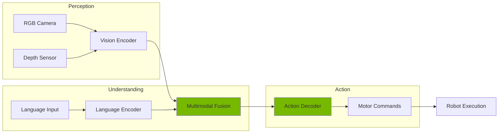
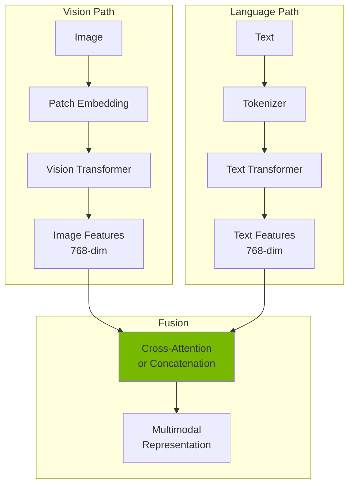
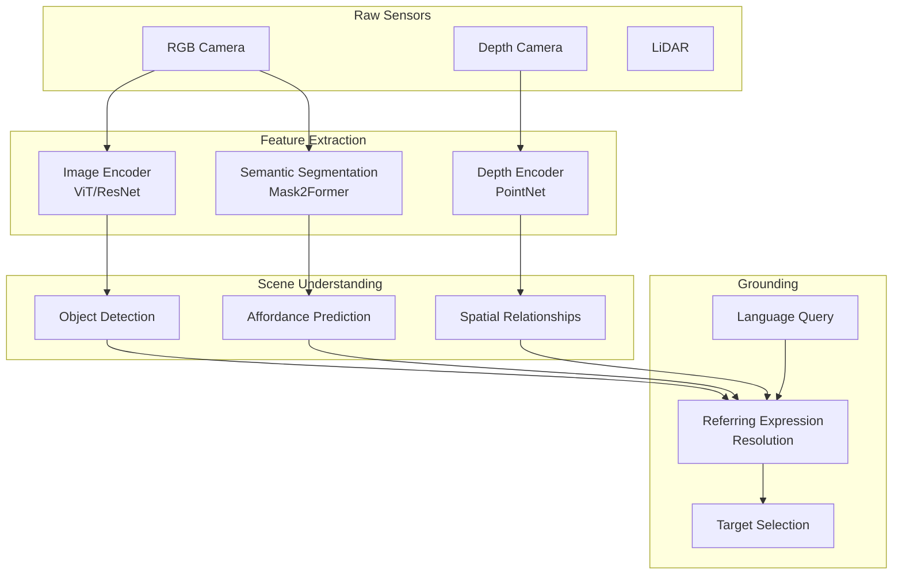
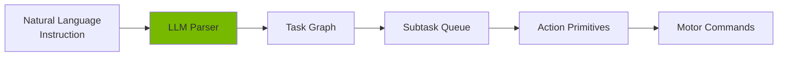
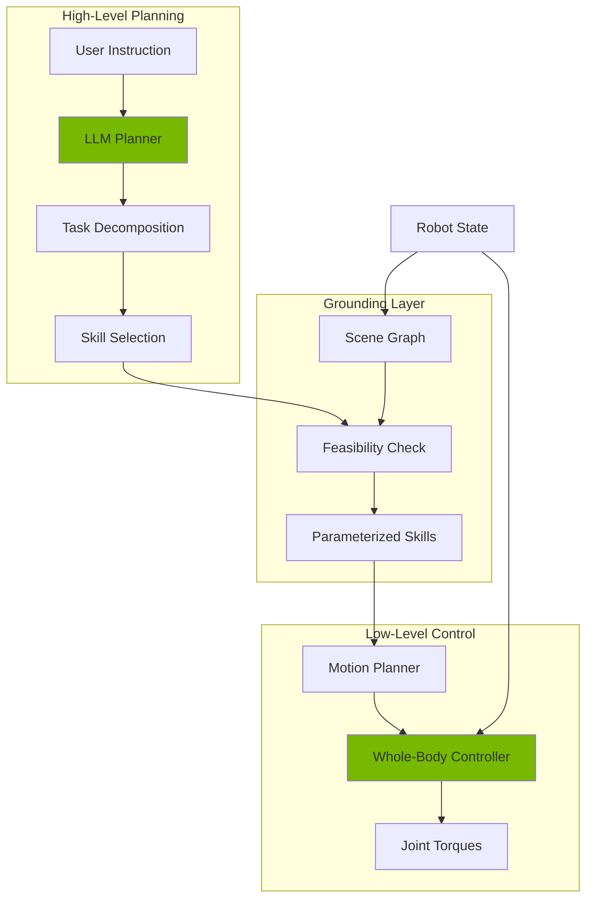
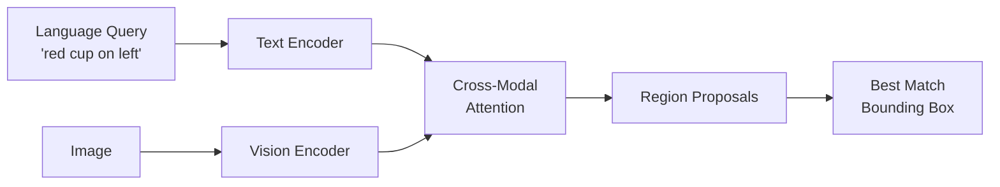
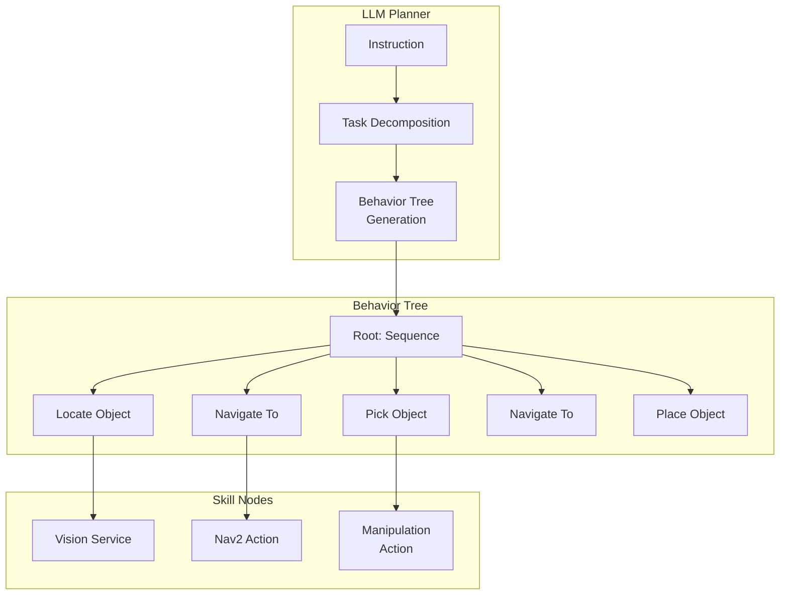
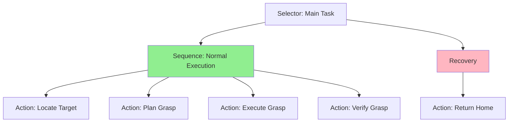

# Chapter 8: Vision–Language–Action Robotics — Multimodal Intelligence for Humanoids

> *"The future of robotics is not just seeing or understanding—it's acting on both."*

---

## 1. Introduction

### What is VLA?

**Vision–Language–Action (VLA)** is the paradigm where robots perceive the world visually, understand natural language instructions, and execute physical actions—all within a unified framework.

| Component | Function |
|-----------|----------|
| **Vision** | RGB/depth perception, object detection, scene understanding |
| **Language** | Instruction parsing, task decomposition, dialogue |
| **Action** | Motion planning, control policies, physical execution |

### Why VLA is Critical for Humanoids

1. **Natural interaction** — Humans communicate via speech; VLA enables verbal commands
2. **Generalization** — Language abstracts tasks; one model handles many scenarios
3. **Zero-shot transfer** — New instructions without retraining
4. **Semantic grounding** — Actions tied to meaningful world understanding

### VLA Architecture



---

## 2. Foundations of Vision-Language Models

### Key Architectures

| Model | Architecture | Key Innovation |
|-------|--------------|----------------|
| **CLIP** | Dual encoder (ViT + Transformer) | Contrastive image-text pretraining |
| **BLIP-2** | Frozen encoders + Q-Former | Efficient vision-language bridging |
| **Flamingo** | Perceiver Resampler + LLM | Few-shot multimodal learning |
| **GPT-4V** | Unified multimodal transformer | End-to-end vision-language reasoning |
| **PaLM-E** | 562B multimodal model | Embodied reasoning at scale |

### Embedding Spaces



### Contrastive Learning (CLIP)

```python
# Simplified CLIP forward pass
import torch
import torch.nn.functional as F

def clip_forward(image_encoder, text_encoder, images, texts):
    # Encode modalities
    image_features = image_encoder(images)  # (B, D)
    text_features = text_encoder(texts)      # (B, D)

    # L2 normalize
    image_features = F.normalize(image_features, dim=-1)
    text_features = F.normalize(text_features, dim=-1)

    # Cosine similarity as logits
    logits = image_features @ text_features.T * 100.0  # temperature

    return logits  # (B, B) similarity matrix
```

---

## 3. Action Models for Robotics

### Policy Types

| Policy Type | Description | Pros | Cons |
|-------------|-------------|------|------|
| **Behavior Cloning** | Supervised learning from demos | Simple, fast | Distribution shift |
| **Diffusion Policy** | Denoising action sequences | Multimodal, expressive | Slow inference |
| **RT-1/RT-2** | Transformer policy from Google | End-to-end VLA | Compute intensive |
| **ACT** | Action Chunking Transformer | Handles contact tasks | Requires many demos |

### Closed-Loop vs Open-Loop

| Mode | Description | Use Case |
|------|-------------|----------|
| **Open-loop** | Generate full trajectory, execute without feedback | Simple motions |
| **Closed-loop** | Generate action, observe, re-plan | Contact-rich tasks |

### Action Generation Loop

```python
# Closed-loop VLA execution
def vla_control_loop(
    vision_encoder,
    language_encoder,
    policy,
    robot,
    instruction: str,
    max_steps: int = 100
):
    # Encode instruction once
    lang_embedding = language_encoder(instruction)

    for step in range(max_steps):
        # Get current observation
        rgb, depth = robot.get_camera_data()
        joint_state = robot.get_joint_positions()

        # Encode vision
        vision_embedding = vision_encoder(rgb, depth)

        # Fuse modalities
        observation = {
            'vision': vision_embedding,
            'language': lang_embedding,
            'proprioception': joint_state
        }

        # Generate action
        action = policy.predict(observation)

        # Safety check
        if not is_safe(action, robot):
            break

        # Execute
        robot.apply_action(action)

        # Check termination
        if policy.is_done(observation):
            break
```

---

## 4. Perception Pipeline for VLA Robots

### Pipeline Architecture



### Perception Tasks & Models

| Task | Model | Output | Latency (Jetson) |
|------|-------|--------|------------------|
| Object Detection | YOLOv8 | Bounding boxes | 11ms |
| Instance Segmentation | Mask2Former | Per-pixel masks | 45ms |
| Depth Estimation | DPT | Dense depth map | 28ms |
| 6-DoF Pose | FoundationPose | Object poses | 35ms |
| Affordance | Where2Act | Actionable regions | 52ms |
| Scene Graph | Neural Motifs | Object relationships | 67ms |

### Affordance Detection

```python
# Predict where robot can interact with objects
def detect_affordances(rgb, depth, object_masks):
    affordances = {}

    for obj_id, mask in object_masks.items():
        # Extract object region
        obj_rgb = rgb * mask[..., None]
        obj_depth = depth * mask

        # Predict graspable points
        grasp_points = grasp_model(obj_rgb, obj_depth)

        # Predict pushable surfaces
        push_surfaces = push_model(obj_rgb, obj_depth)

        affordances[obj_id] = {
            'grasp': grasp_points,  # [(x, y, z, quat, width), ...]
            'push': push_surfaces,   # [(x, y, z, normal), ...]
            'support': is_support_surface(obj_depth)
        }

    return affordances
```

---

## 5. Language-to-Action Interpretation

### Task Decomposition Pipeline



### Example: Instruction Parsing

**Input:**
```
"Pick up the red cup from the table and place it on the shelf."
```

**Structured Output:**
```json
{
  "tasks": [
    {
      "action": "locate",
      "target": {"type": "cup", "color": "red"},
      "reference": {"type": "table"}
    },
    {
      "action": "pick",
      "target": "located_object",
      "grasp_type": "top"
    },
    {
      "action": "navigate",
      "target": {"type": "shelf"}
    },
    {
      "action": "place",
      "target": "held_object",
      "reference": {"type": "shelf"}
    }
  ]
}
```

### ROS 2 Instruction Parser Node

```python
import rclpy
from rclpy.node import Node
from std_msgs.msg import String
from humanoid_msgs.msg import TaskPlan
import json
import openai

class InstructionParser(Node):
    def __init__(self):
        super().__init__('instruction_parser')

        self.subscription = self.create_subscription(
            String,
            '/voice_command',
            self.parse_instruction,
            10
        )

        self.publisher = self.create_publisher(
            TaskPlan,
            '/task_plan',
            10
        )

        self.system_prompt = """
        You are a robot task planner. Convert natural language to structured task plans.
        Output JSON with: action, target, reference, parameters.
        Actions: locate, pick, place, navigate, push, open, close.
        """

    def parse_instruction(self, msg: String):
        instruction = msg.data
        self.get_logger().info(f'Parsing: {instruction}')

        # Call LLM for parsing
        response = openai.ChatCompletion.create(
            model="gpt-4",
            messages=[
                {"role": "system", "content": self.system_prompt},
                {"role": "user", "content": instruction}
            ],
            temperature=0.0
        )

        plan_json = response.choices[0].message.content
        plan = json.loads(plan_json)

        # Publish task plan
        task_msg = TaskPlan()
        task_msg.header.stamp = self.get_clock().now().to_msg()
        task_msg.instruction = instruction
        task_msg.plan_json = json.dumps(plan)
        task_msg.num_subtasks = len(plan.get('tasks', []))

        self.publisher.publish(task_msg)
        self.get_logger().info(f'Published plan with {task_msg.num_subtasks} subtasks')

def main():
    rclpy.init()
    node = InstructionParser()
    rclpy.spin(node)
    rclpy.shutdown()

if __name__ == '__main__':
    main()
```

---

## 6. Embodied LLMs for Robotics

### Grounding Challenge

LLMs understand language but lack:
- Physical world state
- Robot capabilities/constraints
- Real-time sensor feedback
- Safety awareness

### Architecture: LLM Planner + Robot Executor



### LLM + Robot Skills API

```python
class EmbodiedLLMPlanner:
    def __init__(self, robot_api):
        self.robot = robot_api
        self.skills = {
            'pick': self.robot.pick_object,
            'place': self.robot.place_object,
            'navigate': self.robot.navigate_to,
            'look_at': self.robot.look_at,
            'open': self.robot.open_container,
            'close': self.robot.close_container
        }

    def execute_plan(self, plan: dict):
        results = []

        for task in plan['tasks']:
            action = task['action']
            if action not in self.skills:
                results.append({'status': 'error', 'msg': f'Unknown action: {action}'})
                continue

            # Ground target to scene
            target = self.ground_reference(task.get('target'))
            if target is None:
                results.append({'status': 'error', 'msg': 'Target not found'})
                continue

            # Execute skill
            skill_fn = self.skills[action]
            success = skill_fn(target, **task.get('parameters', {}))

            results.append({
                'action': action,
                'status': 'success' if success else 'failed'
            })

            if not success:
                break  # Abort on failure

        return results

    def ground_reference(self, ref: dict):
        """Match language reference to detected object."""
        if ref is None:
            return None

        detections = self.robot.get_detections()
        for obj in detections:
            if self.matches(obj, ref):
                return obj
        return None

    def matches(self, obj, ref):
        if ref.get('type') and obj.label != ref['type']:
            return False
        if ref.get('color') and obj.color != ref['color']:
            return False
        return True
```

---

## 7. Vision-Language Grounding (VLG)

### Grounding Pipeline



### Grounding Challenges

| Challenge | Description | Mitigation |
|-----------|-------------|------------|
| **Ambiguity** | "the cup" when multiple cups | Ask clarification, use spatial context |
| **Occlusion** | Target partially hidden | Multi-view, history tracking |
| **Scale variance** | Small objects missed | Multi-scale detection |
| **Novel objects** | Unseen categories | Open-vocabulary models (OWL-ViT) |
| **Referring expressions** | "the one behind X" | Scene graph reasoning |

### Grounding Example

```python
import torch
from transformers import OwlViTProcessor, OwlViTForObjectDetection
from PIL import Image

class VisionLanguageGrounder:
    def __init__(self):
        self.processor = OwlViTProcessor.from_pretrained("google/owlvit-base-patch32")
        self.model = OwlViTForObjectDetection.from_pretrained("google/owlvit-base-patch32")
        self.model.eval()

    def ground(self, image: Image.Image, query: str, threshold: float = 0.1):
        """Find object matching language query in image."""
        # Prepare inputs
        inputs = self.processor(
            text=[[query]],
            images=image,
            return_tensors="pt"
        )

        # Inference
        with torch.no_grad():
            outputs = self.model(**inputs)

        # Post-process
        target_sizes = torch.tensor([image.size[::-1]])
        results = self.processor.post_process_object_detection(
            outputs,
            target_sizes=target_sizes,
            threshold=threshold
        )[0]

        # Return best match
        if len(results['scores']) == 0:
            return None

        best_idx = results['scores'].argmax()
        return {
            'box': results['boxes'][best_idx].tolist(),  # [x1, y1, x2, y2]
            'score': results['scores'][best_idx].item(),
            'query': query
        }

# Usage
grounder = VisionLanguageGrounder()
image = Image.open("scene.jpg")
result = grounder.ground(image, "red cup on the table")
# result: {'box': [120, 80, 200, 180], 'score': 0.87, 'query': 'red cup on the table'}
```

### ROS 2 Grounding Service

```python
import rclpy
from rclpy.node import Node
from sensor_msgs.msg import Image
from humanoid_msgs.srv import GroundQuery
from cv_bridge import CvBridge
from PIL import Image as PILImage

class GroundingService(Node):
    def __init__(self):
        super().__init__('grounding_service')
        self.grounder = VisionLanguageGrounder()
        self.bridge = CvBridge()

        self.srv = self.create_service(
            GroundQuery,
            '/ground_query',
            self.handle_ground_query
        )

        self.latest_image = None
        self.subscription = self.create_subscription(
            Image,
            '/camera/rgb',
            self.image_callback,
            10
        )

    def image_callback(self, msg):
        self.latest_image = self.bridge.imgmsg_to_cv2(msg, 'rgb8')

    def handle_ground_query(self, request, response):
        if self.latest_image is None:
            response.success = False
            return response

        pil_image = PILImage.fromarray(self.latest_image)
        result = self.grounder.ground(pil_image, request.query)

        if result:
            response.success = True
            response.box = result['box']
            response.confidence = result['score']
        else:
            response.success = False

        return response
```

---

## 8. Action Policies + Control Stacks

### End-to-End vs Modular

| Approach | Architecture | Pros | Cons |
|----------|--------------|------|------|
| **End-to-End VLA** | Vision → Policy → Actions | Simple, learns implicitly | Hard to debug, needs lots of data |
| **Modular Pipeline** | Perception → Planning → Control | Interpretable, reusable | Integration complexity |

### Policy Execution in Isaac Sim

```python
from omni.isaac.core import World
from omni.isaac.core.articulations import Articulation
import torch
import numpy as np

class VLAPolicyExecutor:
    def __init__(self, policy_path: str, humanoid: Articulation):
        self.policy = torch.jit.load(policy_path)
        self.policy.eval()
        self.robot = humanoid

        # Observation normalization (from training)
        self.obs_mean = torch.tensor([...])
        self.obs_std = torch.tensor([...])

    def get_observation(self, rgb: np.ndarray, instruction_embedding: np.ndarray):
        # Proprioception
        joint_pos = self.robot.get_joint_positions()
        joint_vel = self.robot.get_joint_velocities()

        # Flatten and concatenate
        obs = np.concatenate([
            joint_pos,
            joint_vel,
            instruction_embedding
        ])

        # Normalize
        obs_tensor = torch.tensor(obs, dtype=torch.float32)
        obs_normalized = (obs_tensor - self.obs_mean) / self.obs_std

        return obs_normalized.unsqueeze(0)

    def step(self, rgb: np.ndarray, instruction_embedding: np.ndarray):
        obs = self.get_observation(rgb, instruction_embedding)

        with torch.no_grad():
            action = self.policy(obs).squeeze(0).numpy()

        # Safety clipping
        action = np.clip(action, -1.0, 1.0)

        # Scale to joint torques
        torques = action * self.robot.max_efforts

        return torques

# Execution loop
world = World()
humanoid = world.scene.get_object("humanoid")
executor = VLAPolicyExecutor("policy.pt", humanoid)

instruction_emb = language_encoder("pick up the red block")

for _ in range(1000):
    rgb = camera.get_rgb()
    torques = executor.step(rgb, instruction_emb)

    # Safety check
    if fall_detector.is_falling(humanoid):
        torques = recovery_controller.get_torques(humanoid)

    humanoid.set_joint_efforts(torques)
    world.step(render=True)
```

### Safety Checks for Humanoids

```python
class SafetyMonitor:
    def __init__(self, robot: Articulation):
        self.robot = robot
        self.torque_limits = robot.max_efforts
        self.joint_limits = robot.joint_limits

    def check_torque_limits(self, torques: np.ndarray) -> np.ndarray:
        return np.clip(torques, -self.torque_limits, self.torque_limits)

    def check_joint_limits(self, positions: np.ndarray) -> bool:
        lower, upper = self.joint_limits
        return np.all(positions >= lower) and np.all(positions <= upper)

    def detect_fall(self) -> bool:
        # Check if base orientation is too tilted
        base_quat = self.robot.get_body_orientation("base_link")
        roll, pitch, _ = quat_to_euler(base_quat)
        return abs(roll) > 0.5 or abs(pitch) > 0.5  # radians

    def detect_collision(self) -> bool:
        # Check contact forces on sensitive links
        contact_data = self.robot.get_contact_data()
        for contact in contact_data:
            if contact.force_magnitude > 500.0:  # N
                return True
        return False

    def emergency_stop(self):
        """Zero all torques and enable damping."""
        zeros = np.zeros(self.robot.num_dof)
        self.robot.set_joint_efforts(zeros)
        self.robot.enable_gravity_compensation()
```

---

## 9. LLM-Based Task Planning (ROS 2 Integration)

### Behavior Tree + LLM Planner



### Behavior Tree Structure



### ROS 2 BT LLM Executor

```python
import rclpy
from rclpy.node import Node
from rclpy.action import ActionClient
from std_msgs.msg import String
from nav2_msgs.action import NavigateToPose
from humanoid_msgs.action import PickObject, PlaceObject
import py_trees
import py_trees_ros

class LLMBehaviorTreeExecutor(Node):
    def __init__(self):
        super().__init__('llm_bt_executor')

        # Action clients
        self.nav_client = ActionClient(self, NavigateToPose, 'navigate_to_pose')
        self.pick_client = ActionClient(self, PickObject, 'pick_object')
        self.place_client = ActionClient(self, PlaceObject, 'place_object')

        # Subscription for LLM-generated plans
        self.plan_sub = self.create_subscription(
            String,
            '/llm_plan',
            self.execute_plan,
            10
        )

    def execute_plan(self, msg: String):
        import json
        plan = json.loads(msg.data)

        # Build behavior tree from plan
        root = py_trees.composites.Sequence("TaskSequence", memory=True)

        for task in plan['tasks']:
            node = self.create_action_node(task)
            if node:
                root.add_child(node)

        # Execute tree
        tree = py_trees_ros.trees.BehaviourTree(root)
        tree.setup(timeout=15.0)

        while tree.root.status not in [
            py_trees.common.Status.SUCCESS,
            py_trees.common.Status.FAILURE
        ]:
            tree.tick()
            rclpy.spin_once(self, timeout_sec=0.1)

        self.get_logger().info(f'Tree completed: {tree.root.status}')

    def create_action_node(self, task: dict):
        action = task['action']

        if action == 'navigate':
            return NavigateAction(
                name=f"Navigate_{task['target']['type']}",
                action_client=self.nav_client,
                target=task['target']
            )
        elif action == 'pick':
            return PickAction(
                name=f"Pick_{task['target']}",
                action_client=self.pick_client,
                target=task['target']
            )
        elif action == 'place':
            return PlaceAction(
                name=f"Place_{task['target']}",
                action_client=self.place_client,
                target=task['reference']
            )
        return None


class NavigateAction(py_trees.behaviour.Behaviour):
    def __init__(self, name, action_client, target):
        super().__init__(name)
        self.client = action_client
        self.target = target
        self.goal_handle = None

    def initialise(self):
        # Look up target position from scene
        goal = NavigateToPose.Goal()
        goal.pose.header.frame_id = 'map'
        goal.pose.pose.position.x = self.target['x']
        goal.pose.pose.position.y = self.target['y']

        future = self.client.send_goal_async(goal)
        future.add_done_callback(self.goal_callback)

    def goal_callback(self, future):
        self.goal_handle = future.result()

    def update(self):
        if self.goal_handle is None:
            return py_trees.common.Status.RUNNING
        if not self.goal_handle.accepted:
            return py_trees.common.Status.FAILURE
        if self.goal_handle.status == 4:  # SUCCEEDED
            return py_trees.common.Status.SUCCESS
        return py_trees.common.Status.RUNNING
```

---

## 10. Summary

### VLA Pipeline Components

| Stage | Component | Function |
|-------|-----------|----------|
| Input | Vision Encoder | Extract visual features |
| Input | Language Encoder | Embed instructions |
| Fusion | Cross-Attention | Align modalities |
| Planning | LLM Planner | Task decomposition |
| Grounding | VLG Model | Match language to objects |
| Execution | Policy Network | Generate actions |
| Control | WBC / ros2_control | Execute motor commands |

### Key Takeaways

1. **VLA unifies perception, language, and action** — Essential for natural human-robot interaction
2. **Grounding is critical** — Language must map to physical world state
3. **Modular > End-to-End for safety** — Interpretability enables debugging
4. **LLMs plan, policies execute** — Separate high-level reasoning from low-level control
5. **Safety monitors are mandatory** — Fall detection, torque limits, collision checks

### Next Steps

- Chapter 9: Manipulation and Grasping for Humanoids
- Chapter 10: Human-Robot Interaction
- Chapter 11: Multi-Robot Coordination

---

## 11. Review Questions

### Conceptual Questions

1. What is VLA (Vision-Language-Action) and why is it important for humanoid robotics?

2. Explain the difference between vision-language models (VLM) and vision-language-action models (VLA).

3. What is "grounding" in the context of VLA systems? Why is it critical for robotic manipulation?

4. Compare CLIP, BLIP-2, and Flamingo architectures. What are the key innovations of each?

5. What is contrastive learning and how does CLIP use it to align vision and language representations?

6. Explain the difference between behavior cloning and diffusion policies. When would you use each?

7. What is the difference between open-loop and closed-loop action generation? Give examples of tasks suited to each.

8. Why do embodied LLMs require "grounding"? What happens if an LLM generates plans without physical world awareness?

9. What is a Behavior Tree and why is it useful for robotic task execution?

10. Explain the concept of "affordances" in robotic perception. How do they help with manipulation?

### Technical Questions

11. A VLA model processes 640×480 RGB images at 30 FPS. The vision encoder takes 15ms, language encoder takes 5ms, and fusion takes 8ms. What is the total inference latency? Can this run in real-time?

12. Design a cross-attention mechanism that fuses image features (batch, 196, 768) with text features (batch, 77, 768). What is the output shape?

13. You need to ground the phrase "the red cup on the left side of the table" to an object in the scene. What perception components are required?

14. A diffusion policy generates action sequences of length 16. Each action has 7 DOF (arm joints). What is the output tensor shape?

15. Calculate the cosine similarity between two normalized embedding vectors: v1 = [0.6, 0.8, 0] and v2 = [0.8, 0.6, 0].

### Practical Questions

16. Design a VLA pipeline for a humanoid robot that must "pick up the bottle and pour water into the glass." List all components needed.

17. Your grounding service returns multiple bounding boxes for "the cup." How would you disambiguate which cup the user meant?

18. Create a task decomposition for the instruction: "Clean the table by putting all dishes in the sink." Show the structured JSON output.

19. The LLM planner generates a plan that includes an impossible action (e.g., "fly to the shelf"). How should the system handle this?

20. Design a safety monitoring system for a VLA humanoid. What checks should run continuously during task execution?

21. Your VLA model has 85% grounding accuracy but only 60% task success rate. What might explain this gap? How would you investigate?

22. Implement a simple ROS 2 service that takes a language query and returns the 3D position of the matching object.

23. A Behavior Tree has a Sequence node with children: [Detect, Navigate, Grasp, Place]. The Grasp action fails. What happens next? How would you add recovery behavior?

24. Your end-to-end VLA model works in simulation but fails on the real robot. List three potential causes and debugging strategies.

25. Design an experiment to compare modular VLA (separate vision, language, action) vs end-to-end VLA. What metrics would you measure?

---

## 12. Glossary

| Term | Definition |
|------|------------|
| **Affordance** | Properties of an object that indicate how it can be interacted with (graspable, pushable, etc.) |
| **ASR** | Automatic Speech Recognition — converts audio to text |
| **Behavior Cloning** | Learning a policy by supervised learning on expert demonstrations |
| **Behavior Tree** | Hierarchical task execution framework using composable nodes |
| **Blackboard** | Shared data storage for communication between Behavior Tree nodes |
| **BLIP** | Bootstrapping Language-Image Pre-training — vision-language model from Salesforce |
| **CLIP** | Contrastive Language-Image Pre-training — OpenAI's vision-language model |
| **Closed-Loop Control** | Control that uses continuous feedback to adjust actions |
| **Contrastive Learning** | Learning by comparing positive and negative pairs |
| **Cross-Attention** | Attention mechanism where queries come from one modality and keys/values from another |
| **Diffusion Policy** | Policy that generates actions by denoising random noise |
| **Embodied AI** | AI systems that interact with the physical world through a body |
| **End-to-End** | System where all components are trained together as one model |
| **Flamingo** | DeepMind's few-shot multimodal model |
| **GPT-4V** | OpenAI's multimodal GPT model with vision capabilities |
| **Grounding** | Mapping abstract language concepts to physical world entities |
| **LLM** | Large Language Model — transformer-based text generation model |
| **Modular Pipeline** | System with separate, independently developed components |
| **Multimodal** | Involving multiple types of input (vision, language, audio, etc.) |
| **Open-Loop Control** | Control that executes a pre-planned sequence without feedback |
| **OWL-ViT** | Open-World Localization Vision Transformer — open-vocabulary object detector |
| **PaLM-E** | Google's embodied multimodal language model |
| **Policy** | Function that maps observations to actions |
| **Referring Expression** | Natural language phrase that identifies a specific object |
| **RT-1/RT-2** | Google's Robotics Transformer models for VLA |
| **Scene Graph** | Graph representation of objects and their relationships in a scene |
| **Task Decomposition** | Breaking a high-level instruction into atomic subtasks |
| **Vision Encoder** | Neural network that extracts features from images |
| **Vision Transformer (ViT)** | Transformer architecture applied to image patches |
| **VLA** | Vision-Language-Action — unified perception-understanding-action paradigm |
| **VLG** | Vision-Language Grounding — matching language to visual regions |
| **VLM** | Vision-Language Model — model that processes both images and text |
| **Zero-Shot** | Performing a task without specific training examples |

---

## References

1. RT-2: Vision-Language-Action Models (Google DeepMind, 2023)
2. PaLM-E: An Embodied Multimodal Language Model (Google, 2023)
3. CLIP: Learning Transferable Visual Models (OpenAI, 2021)
4. OWL-ViT: Open-World Object Detection (Google, 2022)
5. Diffusion Policy: Visuomotor Policy Learning (Columbia, 2023)
6. py_trees_ros: Behavior Trees for ROS 2
7. BLIP-2: Bootstrapping Language-Image Pre-training (Salesforce, 2023)
8. Flamingo: A Visual Language Model (DeepMind, 2022)
