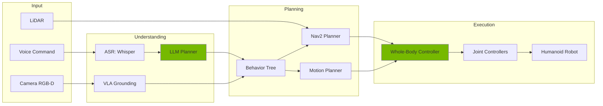
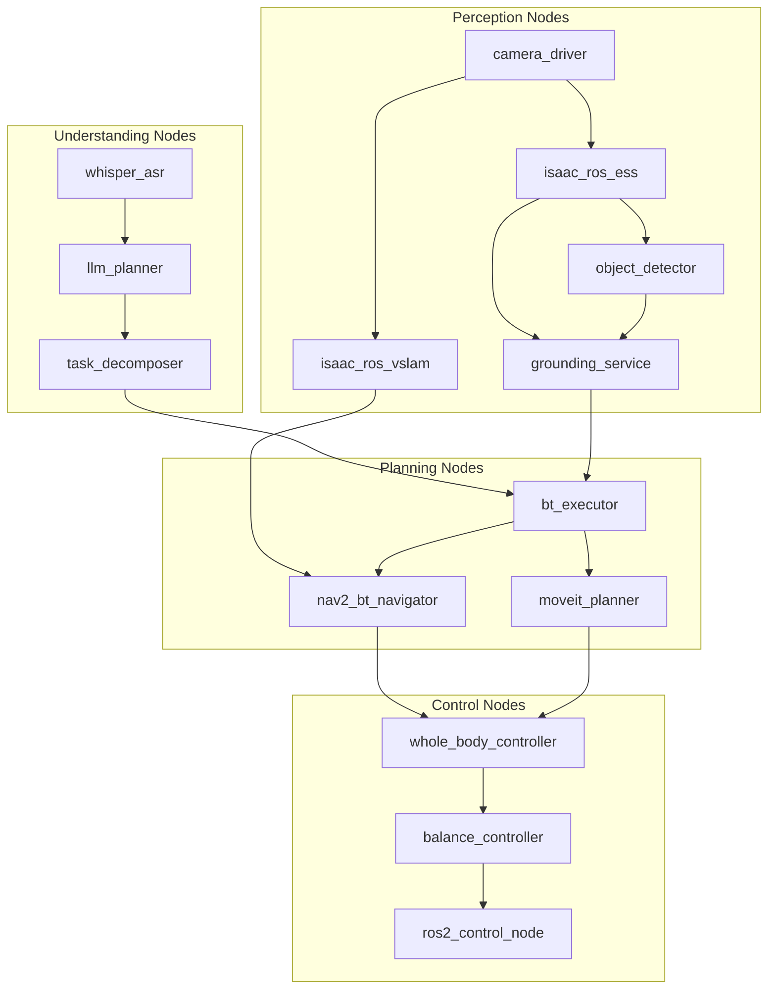
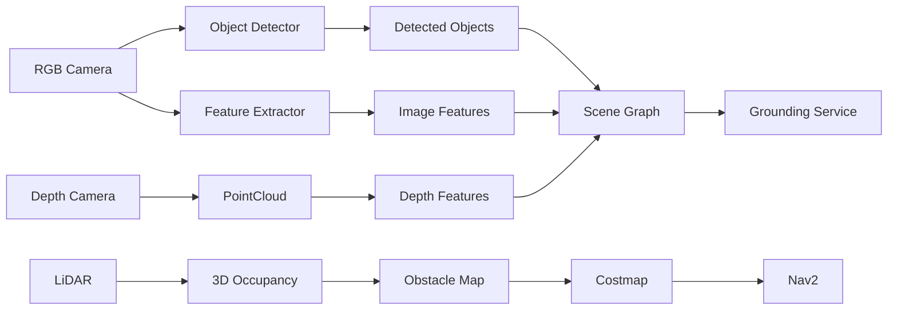
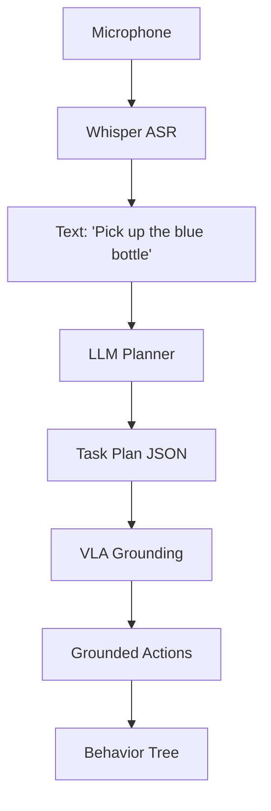
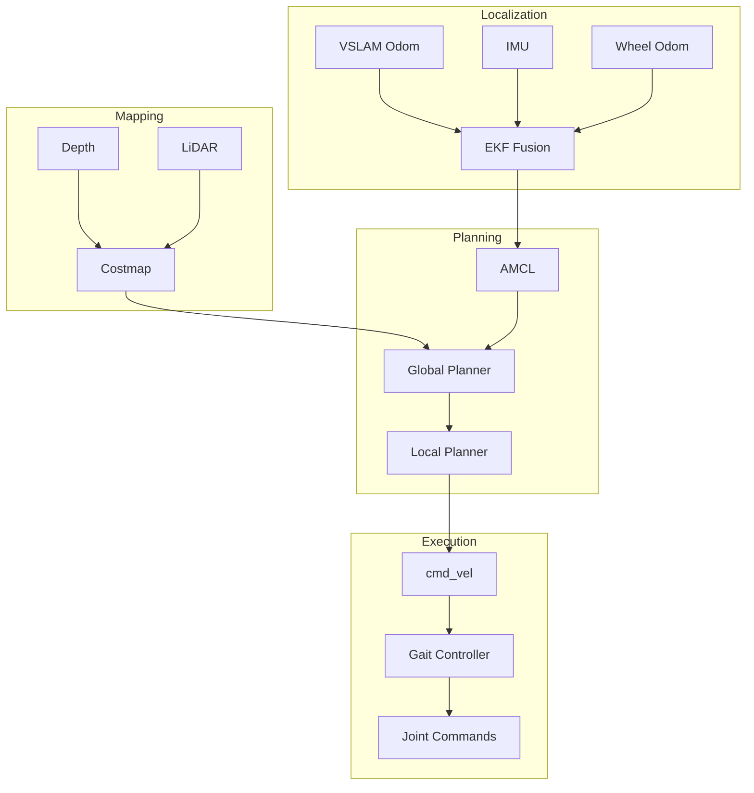
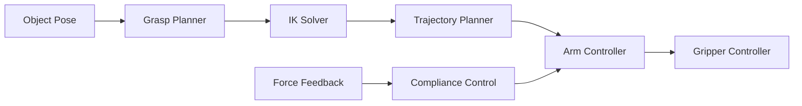
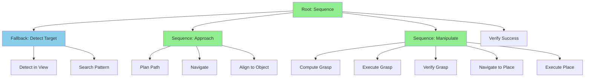
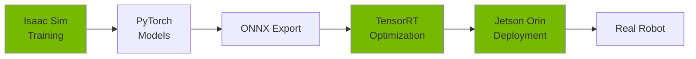
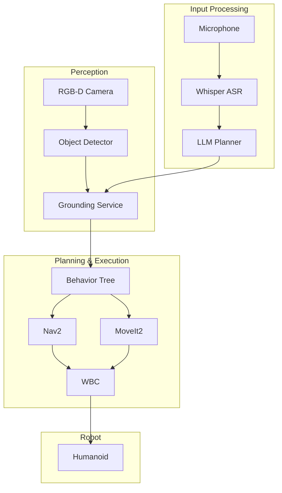

# Chapter 9: Capstone — Building an Autonomous Humanoid Robot

> *"The measure of intelligence is the ability to change."*
> — Albert Einstein

---

## 1. Introduction

### What is the Capstone Project?

This chapter integrates all concepts from Chapters 1–8 into a **complete autonomous humanoid system** capable of:
- Understanding natural language commands
- Perceiving and localizing objects in the environment
- Planning and executing navigation tasks
- Performing manipulation (pick-and-place)
- Operating safely in simulation and real-world

### High-Level Pipeline



---

## 2. System Architecture Overview

### ROS 2 Node Graph



### Component Summary

| Layer | Component | Technology | Function |
|-------|-----------|------------|----------|
| **Perception** | Stereo Camera | Isaac ROS ESS | Depth estimation |
| **Perception** | Visual SLAM | cuVSLAM | Localization |
| **Perception** | Object Detection | YOLOv8 | Instance detection |
| **Perception** | Grounding | OWL-ViT | Language→Object |
| **Understanding** | ASR | Whisper | Speech→Text |
| **Understanding** | Planner | GPT-4 / LLaMA | Task decomposition |
| **Planning** | Task Executor | py_trees | Behavior trees |
| **Planning** | Navigation | Nav2 | Path planning |
| **Planning** | Manipulation | MoveIt2 | Arm trajectories |
| **Control** | WBC | Custom | Whole-body control |
| **Control** | Balance | Custom | CoM regulation |
| **Control** | Joints | ros2_control | Motor interface |

### Hardware Stack

| Component | Simulation | Real Robot |
|-----------|------------|------------|
| Compute | Workstation + RTX 4090 | Jetson Orin |
| Cameras | Isaac Sim RTX | RealSense D455 |
| LiDAR | Isaac Sim LiDAR | Velodyne VLP-16 |
| IMU | Simulated | Xsens MTi-630 |
| Motors | PhysX Articulation | Dynamixel / BLDC |

---

## 3. Perception Stack

### Sensor Pipeline



### Object Localization Node

```python
import rclpy
from rclpy.node import Node
from sensor_msgs.msg import Image, CameraInfo, PointCloud2
from vision_msgs.msg import Detection3DArray, Detection3D
from cv_bridge import CvBridge
import numpy as np
import cv2
from ultralytics import YOLO

class ObjectLocalizer(Node):
    def __init__(self):
        super().__init__('object_localizer')
        self.bridge = CvBridge()
        self.model = YOLO('yolov8n.pt')

        # Camera intrinsics
        self.K = None

        # Subscribers
        self.rgb_sub = self.create_subscription(
            Image, '/camera/rgb', self.rgb_callback, 10)
        self.depth_sub = self.create_subscription(
            Image, '/camera/depth', self.depth_callback, 10)
        self.info_sub = self.create_subscription(
            CameraInfo, '/camera/camera_info', self.info_callback, 10)

        # Publisher
        self.det_pub = self.create_publisher(
            Detection3DArray, '/detections_3d', 10)

        self.latest_depth = None

    def info_callback(self, msg):
        self.K = np.array(msg.k).reshape(3, 3)

    def depth_callback(self, msg):
        self.latest_depth = self.bridge.imgmsg_to_cv2(msg, '32FC1')

    def rgb_callback(self, msg):
        if self.K is None or self.latest_depth is None:
            return

        rgb = self.bridge.imgmsg_to_cv2(msg, 'bgr8')
        results = self.model(rgb, verbose=False)[0]

        detections = Detection3DArray()
        detections.header = msg.header

        for box in results.boxes:
            x1, y1, x2, y2 = box.xyxy[0].cpu().numpy()
            cx, cy = int((x1 + x2) / 2), int((y1 + y2) / 2)

            # Get depth at center
            depth = self.latest_depth[cy, cx]
            if depth <= 0 or depth > 10:
                continue

            # Back-project to 3D
            fx, fy = self.K[0, 0], self.K[1, 1]
            cx_k, cy_k = self.K[0, 2], self.K[1, 2]

            x_3d = (cx - cx_k) * depth / fx
            y_3d = (cy - cy_k) * depth / fy
            z_3d = depth

            det = Detection3D()
            det.bbox.center.position.x = x_3d
            det.bbox.center.position.y = y_3d
            det.bbox.center.position.z = z_3d
            det.results.append(self.make_hypothesis(
                int(box.cls), float(box.conf)))
            detections.detections.append(det)

        self.det_pub.publish(detections)

    def make_hypothesis(self, class_id, score):
        from vision_msgs.msg import ObjectHypothesisWithPose
        h = ObjectHypothesisWithPose()
        h.hypothesis.class_id = str(class_id)
        h.hypothesis.score = score
        return h

def main():
    rclpy.init()
    node = ObjectLocalizer()
    rclpy.spin(node)
    rclpy.shutdown()
```

---

## 4. Language→Action Pipeline

### Pipeline Flow



### Example Task Decomposition

**Input:**
```
"Pick up the blue bottle and place it on the table."
```

**Output:**
```json
{
  "instruction": "Pick up the blue bottle and place it on the table.",
  "tasks": [
    {"id": 1, "action": "detect", "target": "blue bottle"},
    {"id": 2, "action": "navigate", "target": "blue bottle", "distance": 0.5},
    {"id": 3, "action": "grasp", "target": "blue bottle", "grasp_type": "top"},
    {"id": 4, "action": "detect", "target": "table"},
    {"id": 5, "action": "navigate", "target": "table", "distance": 0.3},
    {"id": 6, "action": "place", "surface": "table", "position": "center"}
  ],
  "success_condition": "blue bottle on table"
}
```

### LLM Planner Node

```python
import rclpy
from rclpy.node import Node
from std_msgs.msg import String
from humanoid_msgs.msg import TaskPlan
import json
import requests

class LLMPlannerNode(Node):
    def __init__(self):
        super().__init__('llm_planner')

        self.declare_parameter('model', 'gpt-4')
        self.declare_parameter('api_url', 'https://api.openai.com/v1/chat/completions')

        self.sub = self.create_subscription(
            String, '/asr_text', self.plan_callback, 10)
        self.pub = self.create_publisher(
            TaskPlan, '/task_plan', 10)

        self.system_prompt = """You are a humanoid robot task planner.
Convert natural language instructions into structured JSON task plans.
Available actions: detect, navigate, grasp, place, open, close, push, wait.
Each task needs: id, action, target, and relevant parameters.
Output only valid JSON."""

    def plan_callback(self, msg: String):
        instruction = msg.data
        self.get_logger().info(f'Planning: {instruction}')

        response = requests.post(
            self.get_parameter('api_url').value,
            headers={
                'Authorization': f'Bearer {self.get_api_key()}',
                'Content-Type': 'application/json'
            },
            json={
                'model': self.get_parameter('model').value,
                'messages': [
                    {'role': 'system', 'content': self.system_prompt},
                    {'role': 'user', 'content': instruction}
                ],
                'temperature': 0.0
            }
        )

        plan_json = response.json()['choices'][0]['message']['content']
        plan = json.loads(plan_json)

        task_msg = TaskPlan()
        task_msg.header.stamp = self.get_clock().now().to_msg()
        task_msg.instruction = instruction
        task_msg.plan_json = json.dumps(plan)
        task_msg.num_tasks = len(plan.get('tasks', []))

        self.pub.publish(task_msg)

    def get_api_key(self):
        import os
        return os.environ.get('OPENAI_API_KEY', '')

def main():
    rclpy.init()
    rclpy.spin(LLMPlannerNode())
    rclpy.shutdown()
```

---

## 5. Navigation System

### Navigation Architecture



### Humanoid Navigation Constraints

| Constraint | Value | Reason |
|------------|-------|--------|
| Max linear velocity | 0.4 m/s | Balance stability |
| Max angular velocity | 0.6 rad/s | CoM limits |
| Min turning radius | 0.0 m | Can turn in place |
| Step height | 0.15 m | Stair capability |
| Footprint | Dynamic | Varies with arm pose |

### Navigation Goal Client

```python
import rclpy
from rclpy.node import Node
from rclpy.action import ActionClient
from nav2_msgs.action import NavigateToPose
from geometry_msgs.msg import PoseStamped
from tf_transformations import quaternion_from_euler

class NavGoalClient(Node):
    def __init__(self):
        super().__init__('nav_goal_client')
        self.client = ActionClient(self, NavigateToPose, 'navigate_to_pose')

    async def go_to(self, x: float, y: float, yaw: float) -> bool:
        """Navigate to pose and wait for result."""
        goal = NavigateToPose.Goal()
        goal.pose = PoseStamped()
        goal.pose.header.frame_id = 'map'
        goal.pose.header.stamp = self.get_clock().now().to_msg()
        goal.pose.pose.position.x = x
        goal.pose.pose.position.y = y

        q = quaternion_from_euler(0, 0, yaw)
        goal.pose.pose.orientation.x = q[0]
        goal.pose.pose.orientation.y = q[1]
        goal.pose.pose.orientation.z = q[2]
        goal.pose.pose.orientation.w = q[3]

        self.client.wait_for_server()
        result = await self.client.send_goal_async(goal)

        if not result.accepted:
            return False

        final = await result.get_result_async()
        return final.result.error_code == 0

    def go_to_object(self, detection, offset: float = 0.5):
        """Navigate to detected object with offset."""
        # Transform detection to map frame
        x = detection.pose.position.x - offset
        y = detection.pose.position.y
        yaw = 0.0  # Face the object

        return self.go_to(x, y, yaw)
```

---

## 6. Manipulation System

### Manipulation Pipeline



### Grasp Execution (Isaac Sim)

```python
from omni.isaac.core import World
from omni.isaac.core.articulations import Articulation
from omni.isaac.manipulators import SingleManipulator
from omni.isaac.manipulators.grippers import ParallelGripper
import numpy as np

class HumanoidManipulator:
    def __init__(self, robot: Articulation):
        self.robot = robot
        self.arm_joints = [
            'right_shoulder_pitch', 'right_shoulder_roll',
            'right_shoulder_yaw', 'right_elbow',
            'right_wrist_pitch', 'right_wrist_roll'
        ]
        self.gripper_joint = 'right_gripper'

    def move_to_pose(self, target_pos: np.ndarray, target_quat: np.ndarray):
        """Move end-effector to target pose using IK."""
        from omni.isaac.motion_generation import ArticulationKinematicsSolver

        ik_solver = ArticulationKinematicsSolver(
            self.robot,
            'right_hand',
            'base_link'
        )

        joint_positions = ik_solver.compute_inverse_kinematics(
            target_pos, target_quat
        )

        if joint_positions is not None:
            self.robot.set_joint_positions(joint_positions)
            return True
        return False

    def grasp(self, width: float = 0.0):
        """Close gripper to specified width."""
        gripper_idx = self.robot.get_dof_index(self.gripper_joint)
        positions = self.robot.get_joint_positions()
        positions[gripper_idx] = width
        self.robot.set_joint_positions(positions)

    def release(self, width: float = 0.08):
        """Open gripper."""
        self.grasp(width)

    def pick(self, object_pos: np.ndarray, approach_height: float = 0.1):
        """Execute pick sequence."""
        # Approach from above
        approach_pos = object_pos + np.array([0, 0, approach_height])
        self.move_to_pose(approach_pos, np.array([0, 1, 0, 0]))

        # Move to grasp position
        self.move_to_pose(object_pos, np.array([0, 1, 0, 0]))

        # Close gripper
        self.grasp(0.02)

        # Lift
        lift_pos = object_pos + np.array([0, 0, approach_height])
        self.move_to_pose(lift_pos, np.array([0, 1, 0, 0]))

    def place(self, target_pos: np.ndarray, approach_height: float = 0.1):
        """Execute place sequence."""
        approach_pos = target_pos + np.array([0, 0, approach_height])
        self.move_to_pose(approach_pos, np.array([0, 1, 0, 0]))

        self.move_to_pose(target_pos, np.array([0, 1, 0, 0]))
        self.release()

        self.move_to_pose(approach_pos, np.array([0, 1, 0, 0]))
```

### Manipulation Failure Modes

| Failure Mode | Detection | Recovery |
|--------------|-----------|----------|
| IK failure | No solution found | Replan approach angle |
| Grasp slip | F/T sensor drop | Re-grasp with tighter grip |
| Collision | Contact sensor spike | Retract and replan |
| Object miss | No force on close | Re-detect and retry |
| Arm singularity | Jacobian rank loss | Move away from singularity |

---

## 7. Full Behavior Tree for Humanoid Autonomy

### BT Structure



### BT XML Snippet

```xml
<root BTCPP_format="4">
  <BehaviorTree ID="PickAndPlace">
    <Sequence name="main">
      <!-- Detect Target -->
      <Fallback name="find_object">
        <Action ID="DetectObject" target="{target}" result="{detection}"/>
        <Sequence name="search">
          <Action ID="RotateInPlace" angle="0.5"/>
          <Action ID="DetectObject" target="{target}" result="{detection}"/>
        </Sequence>
      </Fallback>

      <!-- Navigate to Object -->
      <Sequence name="approach">
        <Action ID="ComputeApproachPose" detection="{detection}" pose="{approach_pose}"/>
        <Action ID="NavigateToPose" goal="{approach_pose}"/>
        <Action ID="AlignToObject" detection="{detection}"/>
      </Sequence>

      <!-- Grasp -->
      <Sequence name="grasp">
        <Action ID="PlanGrasp" detection="{detection}" grasp="{grasp_pose}"/>
        <Action ID="ExecuteGrasp" grasp="{grasp_pose}"/>
        <Condition ID="IsGrasping"/>
      </Sequence>

      <!-- Place -->
      <Sequence name="place">
        <Action ID="NavigateToPose" goal="{place_location}"/>
        <Action ID="ExecutePlace" pose="{place_pose}"/>
        <Action ID="OpenGripper"/>
      </Sequence>

      <!-- Verify -->
      <Action ID="VerifyPlacement" target="{target}" location="{place_location}"/>
    </Sequence>
  </BehaviorTree>
</root>
```

### BT Executor Node

```python
import rclpy
from rclpy.node import Node
from rclpy.action import ActionClient
import py_trees
import py_trees_ros
from humanoid_msgs.action import PickObject, PlaceObject
from nav2_msgs.action import NavigateToPose
from humanoid_msgs.srv import DetectObject, PlanGrasp

class BTExecutor(Node):
    def __init__(self):
        super().__init__('bt_executor')

        # Action clients
        self.nav_client = ActionClient(self, NavigateToPose, 'navigate_to_pose')
        self.pick_client = ActionClient(self, PickObject, 'pick_object')
        self.place_client = ActionClient(self, PlaceObject, 'place_object')

        # Service clients
        self.detect_client = self.create_client(DetectObject, 'detect_object')
        self.grasp_client = self.create_client(PlanGrasp, 'plan_grasp')

        # Blackboard for BT data sharing
        self.blackboard = py_trees.blackboard.Blackboard()

    def build_tree(self, target: str, place_location: dict):
        """Build behavior tree for pick-and-place."""
        root = py_trees.composites.Sequence("PickAndPlace", memory=True)

        # Detection
        detect = DetectAction("Detect", self.detect_client, target, self.blackboard)
        root.add_child(detect)

        # Navigate to object
        nav_to_obj = NavigateAction("NavToObject", self.nav_client, self.blackboard, 'object_pose')
        root.add_child(nav_to_obj)

        # Grasp
        grasp = GraspAction("Grasp", self.pick_client, self.blackboard)
        root.add_child(grasp)

        # Navigate to place
        self.blackboard.set('place_pose', place_location)
        nav_to_place = NavigateAction("NavToPlace", self.nav_client, self.blackboard, 'place_pose')
        root.add_child(nav_to_place)

        # Place
        place = PlaceAction("Place", self.place_client, self.blackboard)
        root.add_child(place)

        return root

    def execute(self, target: str, place_location: dict):
        tree = self.build_tree(target, place_location)
        bt = py_trees_ros.trees.BehaviourTree(tree)
        bt.setup(timeout=15.0)

        while bt.root.status == py_trees.common.Status.RUNNING:
            bt.tick()
            rclpy.spin_once(self, timeout_sec=0.1)

        return bt.root.status == py_trees.common.Status.SUCCESS
```

---

## 8. Sim-to-Real Deployment

### Deployment Pipeline



### Domain Randomization Summary

| Parameter | Training Range | Purpose |
|-----------|----------------|---------|
| Lighting | 0.3-1.5× | Brightness variation |
| Object texture | 50 materials | Visual diversity |
| Mass | ±20% | Weight uncertainty |
| Friction | 0.4-1.2 | Surface variation |
| Sensor noise | ±3% | Measurement noise |
| Camera pose | ±2cm, ±3° | Calibration error |
| Action delay | 0-40ms | Latency simulation |

### Real Robot Testing Checklist

**Pre-deployment:**
- [ ] Emergency stop tested and accessible
- [ ] Joint limits verified in software and hardware
- [ ] Torque limits configured
- [ ] Communication latency measured (<20ms)
- [ ] Battery level sufficient (>50%)

**Model validation:**
- [ ] ONNX model exported and tested
- [ ] TensorRT engine built for target GPU
- [ ] Inference latency verified (<30ms)
- [ ] Output range matches training

**Safety systems:**
- [ ] Fall detection enabled
- [ ] Collision detection thresholds set
- [ ] Safe torque limits enforced
- [ ] Watchdog timer active

**Integration tests:**
- [ ] Perception pipeline verified
- [ ] Navigation goals achievable
- [ ] Manipulation accuracy tested
- [ ] Full pipeline end-to-end pass

---

## 9. Complete Mini Project

### Project: Voice-Commanded Object Relocation

**Description:** Humanoid robot receives a voice command, identifies and locates the target object, navigates to it, picks it up, and places it at the specified location.

### Requirements

| Requirement | Specification |
|-------------|---------------|
| Input | Voice command via microphone |
| Objects | Common household items (cups, bottles, boxes) |
| Workspace | 3m × 3m indoor environment |
| Success metric | Object placed within 5cm of target |
| Latency | <30s from command to completion |

### Architecture



### Code Example 1: ASR Node

```python
import rclpy
from rclpy.node import Node
from std_msgs.msg import String
from audio_msgs.msg import AudioData
import whisper
import numpy as np

class WhisperASRNode(Node):
    def __init__(self):
        super().__init__('whisper_asr')
        self.model = whisper.load_model('base')
        self.audio_buffer = []

        self.sub = self.create_subscription(
            AudioData, '/audio', self.audio_callback, 10)
        self.pub = self.create_publisher(
            String, '/asr_text', 10)

        # Silence detection
        self.silence_threshold = 0.01
        self.silence_duration = 1.0  # seconds
        self.last_speech_time = self.get_clock().now()

    def audio_callback(self, msg: AudioData):
        audio = np.frombuffer(msg.data, dtype=np.int16).astype(np.float32) / 32768.0
        self.audio_buffer.extend(audio)

        # Check for silence (end of utterance)
        if np.abs(audio).mean() < self.silence_threshold:
            elapsed = (self.get_clock().now() - self.last_speech_time).nanoseconds / 1e9
            if elapsed > self.silence_duration and len(self.audio_buffer) > 16000:
                self.transcribe()
        else:
            self.last_speech_time = self.get_clock().now()

    def transcribe(self):
        audio_array = np.array(self.audio_buffer, dtype=np.float32)
        result = self.model.transcribe(audio_array, language='en')

        text = result['text'].strip()
        if text:
            msg = String()
            msg.data = text
            self.pub.publish(msg)
            self.get_logger().info(f'Transcribed: {text}')

        self.audio_buffer = []

def main():
    rclpy.init()
    rclpy.spin(WhisperASRNode())
    rclpy.shutdown()
```

### Code Example 2: Task Executor

```python
import rclpy
from rclpy.node import Node
from humanoid_msgs.msg import TaskPlan
from humanoid_msgs.srv import GroundQuery
from nav2_msgs.action import NavigateToPose
from humanoid_msgs.action import PickObject, PlaceObject
from rclpy.action import ActionClient
import json

class TaskExecutor(Node):
    def __init__(self):
        super().__init__('task_executor')

        self.plan_sub = self.create_subscription(
            TaskPlan, '/task_plan', self.execute_plan, 10)

        self.ground_client = self.create_client(GroundQuery, '/ground_query')
        self.nav_client = ActionClient(self, NavigateToPose, 'navigate_to_pose')
        self.pick_client = ActionClient(self, PickObject, 'pick_object')
        self.place_client = ActionClient(self, PlaceObject, 'place_object')

    async def execute_plan(self, msg: TaskPlan):
        plan = json.loads(msg.plan_json)
        self.get_logger().info(f'Executing plan with {len(plan["tasks"])} tasks')

        context = {}  # Store intermediate results

        for task in plan['tasks']:
            success = await self.execute_task(task, context)
            if not success:
                self.get_logger().error(f'Task failed: {task}')
                return

        self.get_logger().info('Plan completed successfully')

    async def execute_task(self, task: dict, context: dict) -> bool:
        action = task['action']

        if action == 'detect':
            # Ground language to object
            req = GroundQuery.Request()
            req.query = task['target']
            result = await self.ground_client.call_async(req)
            if result.success:
                context[task['target']] = result
                return True
            return False

        elif action == 'navigate':
            target = context.get(task['target'])
            if not target:
                return False
            # Navigate to offset from target
            goal = NavigateToPose.Goal()
            goal.pose.header.frame_id = 'map'
            goal.pose.pose.position.x = target.position.x - task.get('distance', 0.5)
            goal.pose.pose.position.y = target.position.y
            result = await self.nav_client.send_goal_async(goal)
            return result.accepted

        elif action == 'grasp':
            goal = PickObject.Goal()
            goal.object_id = task['target']
            goal.grasp_type = task.get('grasp_type', 'top')
            result = await self.pick_client.send_goal_async(goal)
            return result.accepted

        elif action == 'place':
            goal = PlaceObject.Goal()
            goal.surface = task['surface']
            goal.position = task.get('position', 'center')
            result = await self.place_client.send_goal_async(goal)
            return result.accepted

        return False
```

### Code Example 3: Manipulation Action Server

```python
import rclpy
from rclpy.node import Node
from rclpy.action import ActionServer
from humanoid_msgs.action import PickObject
from sensor_msgs.msg import JointState
from trajectory_msgs.msg import JointTrajectory, JointTrajectoryPoint
import numpy as np

class ManipulationServer(Node):
    def __init__(self):
        super().__init__('manipulation_server')

        self._action_server = ActionServer(
            self,
            PickObject,
            'pick_object',
            self.execute_pick
        )

        self.joint_pub = self.create_publisher(
            JointTrajectory, '/arm_controller/joint_trajectory', 10)

        self.arm_joints = [
            'right_shoulder_pitch', 'right_shoulder_roll',
            'right_shoulder_yaw', 'right_elbow',
            'right_wrist_pitch', 'right_wrist_roll'
        ]

    async def execute_pick(self, goal_handle):
        self.get_logger().info(f'Picking: {goal_handle.request.object_id}')

        feedback = PickObject.Feedback()

        # Phase 1: Move to pre-grasp
        feedback.phase = 'approach'
        feedback.progress = 0.2
        goal_handle.publish_feedback(feedback)

        pre_grasp = self.compute_pre_grasp(goal_handle.request)
        await self.move_arm(pre_grasp)

        # Phase 2: Move to grasp
        feedback.phase = 'reach'
        feedback.progress = 0.4
        goal_handle.publish_feedback(feedback)

        grasp_pose = self.compute_grasp(goal_handle.request)
        await self.move_arm(grasp_pose)

        # Phase 3: Close gripper
        feedback.phase = 'grasp'
        feedback.progress = 0.6
        goal_handle.publish_feedback(feedback)

        await self.close_gripper()

        # Phase 4: Lift
        feedback.phase = 'lift'
        feedback.progress = 0.8
        goal_handle.publish_feedback(feedback)

        lift_pose = grasp_pose.copy()
        lift_pose[0] -= 0.1  # Lift shoulder
        await self.move_arm(lift_pose)

        # Complete
        feedback.progress = 1.0
        goal_handle.publish_feedback(feedback)

        goal_handle.succeed()
        result = PickObject.Result()
        result.success = True
        return result

    def compute_pre_grasp(self, request) -> np.ndarray:
        # Simplified: return pre-defined pre-grasp pose
        return np.array([0.0, -0.3, 0.0, -1.0, 0.0, 0.0])

    def compute_grasp(self, request) -> np.ndarray:
        return np.array([0.2, -0.3, 0.0, -1.2, 0.0, 0.0])

    async def move_arm(self, joint_positions: np.ndarray):
        traj = JointTrajectory()
        traj.joint_names = self.arm_joints

        point = JointTrajectoryPoint()
        point.positions = joint_positions.tolist()
        point.time_from_start.sec = 2

        traj.points = [point]
        self.joint_pub.publish(traj)

        # Wait for execution
        await self.sleep(2.5)

    async def close_gripper(self):
        # Publish gripper close command
        await self.sleep(1.0)

    async def sleep(self, seconds: float):
        import asyncio
        await asyncio.sleep(seconds)

def main():
    rclpy.init()
    rclpy.spin(ManipulationServer())
    rclpy.shutdown()
```

### Execution Flow

**Simulation:**
1. Launch Isaac Sim with humanoid + environment
2. Start all ROS 2 nodes
3. Speak command: "Pick up the red cup and place it on the shelf"
4. Monitor BT execution in RViz2

**Real Robot:**
1. Power on robot, verify all systems
2. Launch perception + control stack
3. Verify localization in known map
4. Execute same voice command
5. Monitor safety systems throughout

---

## 10. Evaluation Criteria

### Success Metrics

| Metric | Target | Measurement Method |
|--------|--------|-------------------|
| ASR accuracy | >95% | Word error rate |
| Task parsing | >90% | Correct plan generation |
| Object detection | >95% mAP | COCO evaluation |
| Grounding accuracy | >90% | IoU with ground truth |
| Navigation success | >95% | Goal reached within tolerance |
| Grasp success | >80% | Object lifted successfully |
| Place accuracy | <5cm error | Final position vs target |
| End-to-end latency | <30s | Command to completion |
| Safety violations | 0 | Falls, collisions, limit violations |

### Evaluation Table

| Component | Metric | Weight | Score Range |
|-----------|--------|--------|-------------|
| Perception | Detection mAP | 15% | 0-100 |
| Perception | Grounding IoU | 10% | 0-100 |
| Language | ASR WER | 10% | 0-100 (inverted) |
| Language | Plan correctness | 15% | 0-100 |
| Navigation | Success rate | 15% | 0-100 |
| Navigation | Path efficiency | 5% | 0-100 |
| Manipulation | Grasp success | 15% | 0-100 |
| Manipulation | Place accuracy | 10% | 0-100 |
| Safety | Violation count | 5% | 100 - 20×violations |

---

## 11. Review Questions

1. What are the four main stages of the humanoid autonomy pipeline?
2. How does VSLAM differ from wheel odometry for humanoid localization?
3. Why is domain randomization essential for sim-to-real transfer?
4. Explain the role of a Behavior Tree in task execution.
5. What is the purpose of the grounding service in VLA systems?
6. How do you handle IK failures during manipulation?
7. What safety checks should run continuously during autonomous operation?
8. Why use TensorRT for deployment on Jetson?
9. How does the LLM planner decompose natural language into actions?
10. What is the difference between global and local costmaps in Nav2?
11. How do force/torque sensors improve grasp reliability?
12. What parameters should be randomized during training?
13. Explain the flow from microphone input to robot action.
14. Why is whole-body control necessary for humanoid manipulation?
15. How do you verify a grasp was successful?
16. What recovery behaviors should a humanoid implement?
17. How does the Behavior Tree handle task failures?
18. What is NITROS and why is it important for real-time perception?
19. How do you calibrate sensors for accurate object localization?
20. What metrics define success for the capstone project?
21. How does impedance control improve manipulation safety?
22. What is the role of the EKF in state estimation?
23. Why use a blackboard in Behavior Trees?
24. How do you handle ambiguous language commands?
25. What is the purpose of the watchdog timer?

---

## 12. Glossary

| Term | Definition |
|------|------------|
| **ASR** | Automatic Speech Recognition — converts audio to text |
| **Behavior Tree** | Hierarchical task execution framework using nodes |
| **Blackboard** | Shared data storage for BT nodes |
| **CoM** | Center of Mass — critical for balance control |
| **Costmap** | 2D/3D grid representing traversability |
| **cuVSLAM** | CUDA-accelerated Visual SLAM from NVIDIA |
| **Domain Randomization** | Training with varied simulation parameters |
| **EKF** | Extended Kalman Filter — sensor fusion algorithm |
| **ESS** | Efficient Stereo Depth — NVIDIA stereo depth network |
| **Grounding** | Mapping language references to physical objects |
| **IK** | Inverse Kinematics — computing joint angles from pose |
| **Impedance Control** | Compliant control using virtual springs/dampers |
| **LLM** | Large Language Model — GPT-4, LLaMA, etc. |
| **MoveIt2** | ROS 2 motion planning framework |
| **Nav2** | ROS 2 Navigation stack |
| **NITROS** | NVIDIA Isaac Transport for ROS — zero-copy messaging |
| **ONNX** | Open Neural Network Exchange — model format |
| **OWL-ViT** | Open-vocabulary object detection model |
| **PhysX** | NVIDIA physics simulation engine |
| **PointCloud** | 3D point set from depth sensors |
| **QoS** | Quality of Service — ROS 2 communication settings |
| **Sim-to-Real** | Transferring learned policies to physical robots |
| **TensorRT** | NVIDIA inference optimization library |
| **USD** | Universal Scene Description — scene format |
| **VLA** | Vision-Language-Action — multimodal robot AI |
| **VSLAM** | Visual Simultaneous Localization and Mapping |
| **WBC** | Whole-Body Controller — coordinates full robot motion |
| **Whisper** | OpenAI speech recognition model |
| **YOLO** | You Only Look Once — real-time object detector |

---

## Summary

This capstone project demonstrates the full integration of:
- **Perception:** RGB-D cameras, object detection, visual grounding
- **Language:** Speech recognition, LLM task planning
- **Navigation:** VSLAM, Nav2, humanoid-specific constraints
- **Manipulation:** IK, grasp planning, compliant control
- **Execution:** Behavior Trees, safety monitoring
- **Deployment:** Sim-to-real transfer, Jetson optimization

The result is an autonomous humanoid robot capable of understanding and executing natural language commands in both simulation and the real world.

---

## References

1. Nav2 Documentation: https://docs.nav2.org
2. MoveIt2: https://moveit.ros.org
3. py_trees: https://py-trees.readthedocs.io
4. NVIDIA Isaac ROS: https://nvidia-isaac-ros.github.io
5. OpenAI Whisper: https://github.com/openai/whisper
6. BehaviorTree.CPP: https://www.behaviortree.dev
