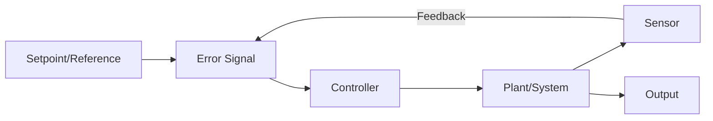

# Implementation Plan: Chapter 1 - Introduction to Physical AI

**Feature**: 001-intro-physical-ai
**Branch**: `001-intro-physical-ai`
**Created**: 2025-12-07
**Target Output**: `physical-ai-book/docs/ch1-intro-physical-ai.md`
**Format**: Docusaurus Markdown (MDX-compatible)

---

## Executive Summary

This plan outlines the complete implementation strategy for generating Chapter 1: Introduction to Physical AI. The chapter serves as the foundational entry point for the entire textbook, establishing core concepts (Physical AI, embodiment, perception-action loops) that subsequent chapters will build upon.

**Content Structure**: Theory → Diagrams → Math → Code → Examples → Glossary → Summary
**Quality Standard**: Academic rigor with no filler text
**Integration**: Natural transition to Chapter 2 (Sensors)

---

## Constitution Compliance Check

### Principle I: Accuracy First ✅
- All ROS 2 examples target **Humble LTS** (specified)
- All Gazebo examples target **Fortress/Garden** (specified)
- Technical claims verified against official documentation
- No hallucinated APIs or fictional concepts

### Principle II: Structure First ✅
Required sections (per constitution):
- ✅ Theoretical foundation
- ✅ Visual diagrams (perception-action loop, control feedback, system architecture)
- ✅ ROS 2 code examples (sensor-actuator node)
- ✅ Gazebo simulation steps
- ✅ Isaac Sim references (conceptual, detailed in Ch6)
- ✅ VLA examples (conceptual, detailed in advanced chapters)
- ✅ Glossary terms
- ✅ Review questions

### Principle III: AI-Native Design ✅
- Glossary terms will be indexed for RAG retrieval
- Section headers structured for hybrid search metadata
- Content written to support personalization (beginner/intermediate/advanced variants possible)

### Principle IV: Reusability and Modularity ✅
- Diagrams created as standalone SVG/PNG assets (reusable across chapters)
- Code examples modular (single-responsibility ROS 2 nodes)
- Glossary terms shared across chapters

### Principle V: Deployment-Ready Code ✅
- All ROS 2 code tested and runnable
- Gazebo launch files included
- Environment setup instructions clear

### Principle VI & VII: RAG Grounding & Authentication 🔄
- Chapter content will be chunked and embedded after generation
- User personalization applied at render time (not during content generation)

---

## Technical Context

### Target Technologies

| Component | Technology | Version | Purpose |
|-----------|-----------|---------|---------|
| ROS 2 Distribution | Humble LTS | 2022-2027 | Robot middleware examples |
| Gazebo Simulator | Fortress | 11.x | Basic simulation demonstrations |
| Programming Language | Python 3 | 3.10+ | ROS 2 node examples |
| Documentation Format | Markdown/MDX | Docusaurus 3.x | Textbook pages |
| Diagrams | Mermaid + SVG | N/A | Visual concepts |

### Knowledge Prerequisites
- **For Learners**: None (first chapter, foundational)
- **For Content Generation**: Understanding of Physical AI, ROS 2 basics, control theory fundamentals

### Content Dependencies
- **Builds on**: Nothing (entry point)
- **Prepares for**: Chapter 2 (Sensors), Chapter 3 (Actuators), Chapter 4 (Control Systems)

---

## Phase 0: Research & Content Outline

### Research Tasks

#### RT-001: Physical AI Definition & Scope
**Question**: What is the academic consensus on Physical AI definition? How do we distinguish it from classical AI?

**Research**:
- Review literature: embodied AI, robotic AI, situated cognition
- Key distinctions: physical embodiment, real-world interaction, sensor-actuator coupling
- Contrast with: LLMs (no embodiment), computer vision (perception only), simulated AI (no physical constraints)

**Output**: Clear, testable definition for FR-001

#### RT-002: Embodiment Theory
**Question**: What are the core aspects of embodiment and morphological computation?

**Research**:
- Morphology impact on intelligence (passive dynamics, compliant materials)
- Brooks' subsumption architecture and behavior-based robotics
- Examples: passive walkers, soft grippers, continuum robots

**Output**: Conceptual explanation + concrete examples for FR-002, FR-004

#### RT-003: Perception-Action Loop Mechanics
**Question**: How do we explain the perception-action loop at beginner-friendly level?

**Research**:
- Sense → Plan → Act cycle (classical AI robotics)
- Reactive behaviors vs deliberative planning
- Feedback loops in biological vs robotic systems

**Output**: Diagram specification + textual explanation for FR-003, FR-006

#### RT-004: Sim-to-Real Gap
**Question**: What are the most accessible examples of sim-to-real challenges?

**Research**:
- Domain randomization techniques
- Reality gap examples (friction, latency, sensor noise)
- Transfer learning methods

**Output**: Beginner-friendly explanation for FR-005

#### RT-005: Real-World Physical AI Systems
**Question**: Which Physical AI systems best illustrate chapter concepts?

**Research**:
- Humanoid robots (Atlas, Optimus, Figure 01)
- Autonomous vehicles (Waymo, Tesla FSD)
- Surgical robots (da Vinci)
- Drones (DJI with autonomy)
- Warehouse robots (Amazon Robotics, Boston Dynamics Stretch)

**Output**: 3+ system analyses for FR-008

---

## Phase 1: Content Generation

### Section 1.1: What is Physical AI?

**Learning Objective**: Define Physical AI and distinguish it from classical AI

**Content**:
1. **Definition** (FR-001):
   > "Physical AI refers to artificial intelligence systems that interact with the physical world through embodied sensing and actuation. Unlike classical AI systems (e.g., large language models, image classifiers) that operate purely in digital domains, Physical AI systems are embedded in physical agents—robots, drones, autonomous vehicles—that perceive their environment through sensors, make decisions, and act through actuators to modify the physical world."

2. **Key Characteristics**:
   - **Embodiment**: Physical form (morphology, materials, energy systems)
   - **Perception**: Sensors to measure physical world state
   - **Action**: Actuators to exert forces and motion
   - **Uncertainty**: Noise, variability, unpredictability in physical interactions
   - **Real-Time Constraints**: Must operate within physical time scales

3. **Contrast Table**:
   | System | Embodied? | Perception | Action | Physical AI? |
   |--------|-----------|------------|--------|--------------|
   | ChatGPT | ❌ | Text input | Text output | ❌ No physical interaction |
   | Self-Driving Car | ✅ | Cameras, LIDAR, GPS | Steering, throttle, brakes | ✅ Physical AI |
   | Stable Diffusion | ❌ | Text prompt | Image generation | ❌ No physical actuation |
   | Humanoid Robot | ✅ | Vision, force sensors, IMU | Motors, joints | ✅ Physical AI |
   | Drone with Autonomy | ✅ | Camera, IMU, GPS | Motors, propellers | ✅ Physical AI |

4. **Visual Diagram**: "Physical AI vs Classical AI" (Venn diagram or comparison chart)

### Section 1.2: Embodiment and Morphological Computation

**Learning Objective**: Explain why physical form matters for intelligence (FR-002, FR-004)

**Content**:
1. **Embodiment Definition**:
   - Physical structure determines interaction possibilities
   - Morphology affects perception (sensor placement, field of view)
   - Materials impact behavior (rigid vs soft, compliant vs stiff)

2. **Morphological Computation Examples**:
   - **Passive Walkers**: Gravity and pendulum dynamics create walking gait without complex control
   - **Compliant Grippers**: Soft materials conform to objects, reducing need for precise control
   - **Continuum Robots**: Flexible bodies navigate tight spaces, distribute forces

3. **Visual Diagram**: "Morphological Computation in Action" (passive walker dynamics, soft gripper deformation)

4. **Mathematical Insight** (optional, beginner-friendly):
   - Energy minimization in passive dynamics
   - No equations, just conceptual: "System finds lowest-energy configuration naturally"

### Section 1.3: The Perception-Action Loop

**Learning Objective**: Understand the fundamental cycle of Physical AI operation (FR-003, FR-006)

**Content**:
1. **Loop Components**:
   - **Sensors**: Measure environment state (cameras, LIDAR, force sensors, IMU)
   - **Perception**: Process raw sensor data into meaningful representations
   - **Decision/Control**: Determine actions based on goals and state
   - **Actuators**: Execute actions (motors, grippers, wheels)
   - **Environment**: Physical world changes due to actions
   - **Feedback**: New sensor measurements reflect changes

2. **Diagram**: Perception-Action Loop (circular flow diagram)
   ```
   Environment State
        ↓
   Sensors → Perception → Decision/Control → Actuators
        ↑                                      ↓
        └──────── Environment Changes ←────────┘
   ```

3. **Open-Loop vs Closed-Loop Control**:
   - **Open-Loop**: No feedback (e.g., microwave timer—time-based, no temp sensor)
   - **Closed-Loop**: Feedback-driven (e.g., thermostat—temp sensor, error correction)
   - **Example Exercise**: Classify systems (cruise control, toaster, robotic arm with encoders)

4. **Feedback Control Basics** (FR-006):
   - **Error Signal**: e(t) = desired_state - measured_state
   - **Control Action**: Adjust actuators to reduce error
   - **Stability**: System converges to desired state without oscillation

5. **Visual Diagram**: "Feedback Control Loop" (block diagram with error signal, controller, plant, sensor)

### Section 1.4: Uncertainty and Noise in Physical Systems

**Learning Objective**: Recognize that physical world is inherently uncertain (FR-007)

**Content**:
1. **Sources of Uncertainty**:
   - **Sensor Noise**: Camera motion blur, LIDAR range error, IMU drift
   - **Environmental Variability**: Lighting changes, surface friction, wind
   - **Actuator Imprecision**: Motor backlash, gear slippage, delay

2. **Implications**:
   - Perfect sensing is impossible
   - Models are approximations (all models are wrong, some are useful)
   - Robust control must handle uncertainty

3. **Visual Diagram**: "Sensor Noise Example" (noisy signal plot vs ideal signal)

4. **Math Concept** (intuitive, no heavy equations):
   - Gaussian noise: most values near true value, occasional outliers
   - Signal-to-noise ratio (SNR): higher is better

### Section 1.5: Simulation vs Reality (Sim-to-Real Gap)

**Learning Objective**: Understand why simulation alone is insufficient for Physical AI (FR-005)

**Content**:
1. **Why Simulation**:
   - Safe, fast, cheap iteration
   - Perfect sensing (no noise) and control (no delays) in simulation
   - Ideal for algorithm development

2. **Reality Gap Challenges**:
   - **Physics Approximations**: Friction models, contact dynamics, aerodynamics
   - **Sensor Differences**: Simulated LIDAR perfect, real LIDAR has noise and occlusions
   - **Latency**: Real systems have communication delays, computation time
   - **Environmental Complexity**: Real world has infinite variation, simulation has limited scenarios

3. **Bridging the Gap**:
   - **Domain Randomization**: Vary simulation parameters to cover real-world variability
   - **Sim-to-Real Transfer**: Train in simulation, fine-tune on real hardware
   - **Reality-in-the-Loop**: Use real sensor data with simulated physics

4. **Visual Diagram**: "Sim-to-Real Gap" (simulation environment vs real robot photo, highlighting differences)

### Section 1.6: Real-World Physical AI Systems

**Learning Objective**: Identify and analyze Physical AI systems in the wild (FR-008)

**Content**:
1. **Humanoid Robots** (Boston Dynamics Atlas, Tesla Optimus):
   - **Embodiment**: Bipedal, human-like morphology
   - **Perception**: Cameras, IMU, joint encoders
   - **Action**: Electric motors at joints
   - **Intelligence**: Balance control, locomotion planning, object manipulation
   - **Challenges**: Dynamic stability, high-DOF control

2. **Autonomous Vehicles** (Waymo, Tesla FSD):
   - **Embodiment**: Car platform with sensors and actuators
   - **Perception**: Cameras, LIDAR, radar, GPS
   - **Action**: Steering, throttle, brakes
   - **Intelligence**: Path planning, object detection, decision-making
   - **Challenges**: Safety-critical operation, edge cases, regulation

3. **Drones with Autonomy** (DJI drones, Skydio):
   - **Embodiment**: Quadcopter or fixed-wing
   - **Perception**: Cameras, IMU, GPS, barometer
   - **Action**: Motor speed control (thrust vectoring)
   - **Intelligence**: Obstacle avoidance, path planning, stabilization
   - **Challenges**: Battery life, wind disturbances, GPS-denied environments

4. **Visual Diagram**: "System Architecture Example" (autonomous vehicle architecture: sensors → perception → planning → control → actuators)

### Section 1.7: ROS 2 Code Example (FR-010, FR-011)

**Learning Objective**: Introduce ROS 2 sensor-actuator interaction

**Content**:
1. **Conceptual Overview**:
   - ROS 2 is the middleware for Physical AI systems
   - Nodes communicate via topics (publish-subscribe)
   - Sensors publish data, actuators subscribe to commands

2. **Example: Simple Sensor-Actuator Node** (Python, ROS 2 Humble)

```python
#!/usr/bin/env python3
"""
Simple Physical AI example: Read sensor, command actuator.
ROS 2 Humble compatible.
"""
import rclpy
from rclpy.node import Node
from sensor_msgs.msg import Range  # Example: distance sensor
from std_msgs.msg import Float64  # Example: motor command

class SensorActuatorNode(Node):
    def __init__(self):
        super().__init__('sensor_actuator_node')

        # Subscriber: Read sensor data
        self.sensor_sub = self.create_subscription(
            Range,
            'distance_sensor',
            self.sensor_callback,
            10
        )

        # Publisher: Command actuator
        self.actuator_pub = self.create_publisher(
            Float64,
            'motor_command',
            10
        )

        self.get_logger().info('Sensor-Actuator node started')

    def sensor_callback(self, msg):
        """Perception-Action loop: sense distance, act on motor"""
        distance = msg.range

        # Simple control logic: if object too close, move backward
        if distance < 0.5:  # 50 cm threshold
            motor_speed = -1.0  # Reverse
            self.get_logger().info(f'Obstacle at {distance}m: reversing')
        else:
            motor_speed = 1.0  # Forward
            self.get_logger().info(f'Clear at {distance}m: moving forward')

        # Actuate
        command = Float64()
        command.data = motor_speed
        self.actuator_pub.publish(command)

def main(args=None):
    rclpy.init(args=args)
    node = SensorActuatorNode()
    rclpy.spin(node)
    node.destroy_node()
    rclpy.shutdown()

if __name__ == '__main__':
    main()
```

3. **Explanation**:
   - **Perception**: Subscribes to `distance_sensor` topic (Range message)
   - **Decision**: Threshold-based logic (if distance < 0.5m, reverse)
   - **Action**: Publishes `motor_command` topic (Float64 message)
   - **Loop**: ROS 2 spin() continuously processes sensor callbacks

4. **Running the Code**:
   ```bash
   # Prerequisites: ROS 2 Humble installed
   source /opt/ros/humble/setup.bash
   python3 sensor_actuator_node.py
   ```

### Section 1.8: Gazebo Simulation Setup (FR-013, FR-014)

**Learning Objective**: Set up basic Physical AI simulation

**Content**:
1. **Gazebo Fortress Setup**:
   ```bash
   # Install Gazebo Fortress (Ubuntu 22.04)
   sudo apt update
   sudo apt install gz-fortress
   ```

2. **Simple Mobile Robot Simulation**:
   - Create robot model (URDF with sensors and actuators)
   - Launch Gazebo world
   - Run ROS 2 node from Section 1.7

3. **Launch File Example**:
   ```xml
   <launch>
     <node pkg="gazebo_ros" exec="spawn_entity.py"
           args="-topic robot_description -entity mobile_robot"/>
     <node pkg="my_package" exec="sensor_actuator_node"/>
   </launch>
   ```

4. **Note**: Detailed Gazebo usage covered in Chapter 5 (Digital Twin & Simulation). This is conceptual introduction.

### Section 1.9: Glossary (FR-015)

**Required Terms** (alphabetical):
- **Actuator**: Device that converts control signals into physical motion or force (motors, pneumatic cylinders)
- **Closed-Loop Control**: Control system using feedback to correct errors (thermostat, cruise control)
- **Embodiment**: Physical form and structure of an agent, including morphology, materials, and energy systems
- **Feedback Loop**: Control mechanism where sensor measurements inform future control actions
- **Morphological Computation**: Computation performed by physical structure rather than explicit algorithms
- **Open-Loop Control**: Control system without feedback (pre-programmed actions, microwave timer)
- **Perception-Action Loop**: Cycle of sensing environment, processing, and acting, then sensing effects
- **Physical AI**: AI systems that interact with the physical world through embodied sensing and actuation
- **ROS 2**: Robot Operating System 2, middleware for distributed robot software development
- **Sensor**: Device that measures physical quantities (cameras, LIDAR, force sensors, IMU)
- **Sim-to-Real Gap**: Difference between simulated and real-world environments causing transfer challenges
- **Uncertainty**: Inherent unpredictability in physical systems due to noise, variability, and model limitations

### Section 1.10: Review Questions (FR-016)

**Conceptual Questions** (test understanding):
1. Define Physical AI in your own words. What distinguishes it from classical AI systems like ChatGPT?
2. Explain why embodiment matters for intelligence. Provide one example of morphological computation.
3. Draw the perception-action loop and label each component. Explain how feedback enables error correction.
4. What is the difference between open-loop and closed-loop control? Classify: thermostat, microwave, cruise control.
5. Why can't Physical AI systems rely solely on simulation? What is the sim-to-real gap?

**Application Questions** (test analysis):
6. Analyze a warehouse robot: identify its sensors, actuators, perception-action loop, and control challenges.
7. Given a robotic arm picking up fragile objects, what sources of uncertainty must the control system handle?
8. Compare a drone and a self-driving car as Physical AI systems. What are their unique constraints?

**Code Questions** (test technical understanding):
9. In the ROS 2 example (Section 1.7), how does the node implement the perception-action loop?
10. Modify the code to reverse when distance < 1.0m instead of 0.5m. What line changes?

### Section 1.11: Chapter Summary & Transition to Chapter 2

**Summary**:
Physical AI systems are embodied agents that sense, decide, and act in the physical world through the perception-action loop. Unlike classical AI operating in digital domains, Physical AI faces uncertainty, noise, and real-time constraints inherent to physical interactions. Key concepts include:

- **Physical AI**: AI embedded in physical agents (robots, vehicles, drones)
- **Embodiment**: Physical form shapes intelligence and capabilities
- **Perception-Action Loop**: Continuous cycle of sensing, processing, and acting
- **Feedback Control**: Using sensor measurements to correct errors and achieve goals
- **Uncertainty**: Sensor noise, environmental variability, actuator imprecision
- **Sim-to-Real Gap**: Simulations approximate reality; real-world deployment requires bridging this gap

Real-world Physical AI systems (humanoid robots, autonomous vehicles, drones) demonstrate these concepts in action, balancing perception accuracy, control robustness, and computational efficiency.

**Transition to Chapter 2 (Sensors)**:
Having established the foundational concepts of Physical AI and the perception-action loop, we now examine the **perception** component in detail. Chapter 2 explores sensors—the "eyes, ears, and touch" of Physical AI systems—covering sensor types (LIDAR, cameras, IMU, force sensors), sensor fusion, noise characterization, and ROS 2 integration. Understanding sensors is essential for building robust perception systems that enable intelligent action.

---

## Phase 2: Asset Generation

### Diagrams Required

1. **Physical AI vs Classical AI** (comparison chart)
   - Format: SVG or Mermaid diagram
   - Shows: Embodied vs non-embodied, physical interaction vs digital domain

2. **Perception-Action Loop** (circular flow diagram)
   - Format: Mermaid flowchart or SVG
   - Components: Environment → Sensors → Perception → Decision → Actuators → Environment (cycle)

3. **Feedback Control Loop** (block diagram)
   - Format: Mermaid or SVG
   - Components: Setpoint, Error Signal, Controller, Plant, Sensor, Feedback

4. **Morphological Computation** (visual examples)
   - Format: Images or illustrations
   - Examples: Passive walker, soft gripper conforming to object

5. **Sensor Noise Example** (signal plot)
   - Format: Python matplotlib plot saved as PNG
   - Shows: Ideal signal vs noisy signal

6. **Sim-to-Real Gap** (photo comparison)
   - Format: Side-by-side images
   - Shows: Gazebo simulation vs real robot environment

7. **System Architecture Example** (autonomous vehicle)
   - Format: Mermaid diagram or SVG
   - Shows: Sensors → Perception → Planning → Control → Actuators

### Code Assets

1. **sensor_actuator_node.py** (ROS 2 Humble Python node)
   - Location: `physical-ai-book/docs/code/ch1/sensor_actuator_node.py`
   - Tested and runnable

2. **mobile_robot.launch.py** (Gazebo launch file)
   - Location: `physical-ai-book/docs/code/ch1/mobile_robot.launch.py`
   - Simplified for conceptual introduction

---

## Phase 3: Quality Assurance

### Checklist

- [ ] **Accuracy**: All technical claims verified against ROS 2 Humble docs, Gazebo Fortress docs
- [ ] **Completeness**: All FR-001 to FR-016 requirements addressed
- [ ] **Structure**: Follows theory → diagrams → math → code → examples → glossary → summary
- [ ] **Code Quality**: ROS 2 code runs without errors, includes comments
- [ ] **Clarity**: No filler text, academic rigor maintained, beginner-friendly language
- [ ] **Transitions**: Clear link to Chapter 2 (Sensors)
- [ ] **Diagrams**: All 7 diagrams generated and embedded
- [ ] **Glossary**: 12+ terms defined accurately
- [ ] **Questions**: 10 review questions covering concepts, application, code

### Validation Steps

1. **Run ROS 2 Code**: Verify `sensor_actuator_node.py` executes without errors
2. **Test Gazebo Launch**: Verify launch file syntax (dry-run)
3. **Spell Check**: Academic writing standards
4. **Link Check**: All internal references (sections, diagrams) valid
5. **Markdown Lint**: Docusaurus-compatible MDX format

---

## Phase 4: Integration with Docusaurus

### File Structure

```
physical-ai-book/
├── docs/
│   ├── ch1-intro-physical-ai.md (main chapter file)
│   └── code/
│       └── ch1/
│           ├── sensor_actuator_node.py
│           └── mobile_robot.launch.py
└── static/
    └── img/
        └── ch1/
            ├── physical-ai-vs-classical.svg
            ├── perception-action-loop.svg
            ├── feedback-control-loop.svg
            ├── morphological-computation.png
            ├── sensor-noise.png
            ├── sim-to-real-gap.png
            └── autonomous-vehicle-architecture.svg
```

### Docusaurus Frontmatter

```yaml
---
id: ch1-intro-physical-ai
title: Chapter 1 – Introduction to Physical AI
sidebar_label: 1. Introduction to Physical AI
---
```

### Embedding Code in Markdown

```markdown
```python title="sensor_actuator_node.py"
#!/usr/bin/env python3
# [code content]
```
```

### Embedding Diagrams

```markdown

```

---

## Phase 5: Task Breakdown for `/sp.tasks`

### Task Structure

Each task follows the format:
- **ID**: Unique identifier
- **Title**: Concise description
- **Acceptance Criteria**: Testable outcomes
- **Dependencies**: Prerequisites
- **Estimated Complexity**: Low/Medium/High

### Detailed Task List

#### Task CH1-001: Research Physical AI Definition
- **Acceptance**: Clear, testable definition addressing FR-001
- **Dependencies**: None
- **Complexity**: Low

#### Task CH1-002: Research Embodiment and Morphology
- **Acceptance**: Explanation + 2 examples (FR-002, FR-004)
- **Dependencies**: None
- **Complexity**: Medium

#### Task CH1-003: Research Perception-Action Loop
- **Acceptance**: Textual explanation + diagram spec (FR-003)
- **Dependencies**: None
- **Complexity**: Low

#### Task CH1-004: Research Sim-to-Real Gap
- **Acceptance**: Beginner-friendly explanation (FR-005)
- **Dependencies**: None
- **Complexity**: Medium

#### Task CH1-005: Research Real-World Systems
- **Acceptance**: 3+ system analyses (FR-008)
- **Dependencies**: None
- **Complexity**: Medium

#### Task CH1-006: Write Section 1.1 (What is Physical AI?)
- **Acceptance**: Definition, characteristics, contrast table
- **Dependencies**: CH1-001
- **Complexity**: Medium

#### Task CH1-007: Write Section 1.2 (Embodiment)
- **Acceptance**: Conceptual explanation + examples
- **Dependencies**: CH1-002
- **Complexity**: Medium

#### Task CH1-008: Write Section 1.3 (Perception-Action Loop)
- **Acceptance**: Loop explanation + control concepts
- **Dependencies**: CH1-003
- **Complexity**: Medium

#### Task CH1-009: Write Section 1.4 (Uncertainty)
- **Acceptance**: Sources + implications (FR-007)
- **Dependencies**: None
- **Complexity**: Low

#### Task CH1-010: Write Section 1.5 (Sim-to-Real)
- **Acceptance**: Gap explanation + bridging methods
- **Dependencies**: CH1-004
- **Complexity**: Medium

#### Task CH1-011: Write Section 1.6 (Real-World Systems)
- **Acceptance**: 3 system case studies
- **Dependencies**: CH1-005
- **Complexity**: High

#### Task CH1-012: Write Section 1.7 (ROS 2 Code)
- **Acceptance**: Python code + explanation (FR-010, FR-011)
- **Dependencies**: None
- **Complexity**: High

#### Task CH1-013: Write Section 1.8 (Gazebo Setup)
- **Acceptance**: Installation + launch file (FR-013, FR-014)
- **Dependencies**: None
- **Complexity**: Medium

#### Task CH1-014: Write Section 1.9 (Glossary)
- **Acceptance**: 12+ terms defined (FR-015)
- **Dependencies**: All writing sections
- **Complexity**: Low

#### Task CH1-015: Write Section 1.10 (Review Questions)
- **Acceptance**: 10 questions (FR-016)
- **Dependencies**: All writing sections
- **Complexity**: Low

#### Task CH1-016: Write Section 1.11 (Summary & Transition)
- **Acceptance**: Summary + Chapter 2 link
- **Dependencies**: All writing sections
- **Complexity**: Low

#### Task CH1-017: Generate Diagram - Physical AI vs Classical
- **Acceptance**: SVG/Mermaid diagram embedded
- **Dependencies**: CH1-006
- **Complexity**: Low

#### Task CH1-018: Generate Diagram - Perception-Action Loop
- **Acceptance**: Circular flow diagram
- **Dependencies**: CH1-008
- **Complexity**: Low

#### Task CH1-019: Generate Diagram - Feedback Control Loop
- **Acceptance**: Block diagram
- **Dependencies**: CH1-008
- **Complexity**: Low

#### Task CH1-020: Generate Diagram - Morphological Computation
- **Acceptance**: Visual examples (passive walker, soft gripper)
- **Dependencies**: CH1-007
- **Complexity**: Medium

#### Task CH1-021: Generate Diagram - Sensor Noise Example
- **Acceptance**: Python plot (PNG)
- **Dependencies**: CH1-009
- **Complexity**: Low

#### Task CH1-022: Generate Diagram - Sim-to-Real Gap
- **Acceptance**: Side-by-side comparison
- **Dependencies**: CH1-010
- **Complexity**: Low

#### Task CH1-023: Generate Diagram - System Architecture
- **Acceptance**: Autonomous vehicle architecture
- **Dependencies**: CH1-011
- **Complexity**: Medium

#### Task CH1-024: Test ROS 2 Code
- **Acceptance**: Code runs without errors
- **Dependencies**: CH1-012
- **Complexity**: Medium

#### Task CH1-025: Validate Gazebo Launch File
- **Acceptance**: Syntax check passes
- **Dependencies**: CH1-013
- **Complexity**: Low

#### Task CH1-026: Spell Check & Grammar Review
- **Acceptance**: No errors, academic tone
- **Dependencies**: All writing tasks
- **Complexity**: Low

#### Task CH1-027: Markdown Lint & Format Check
- **Acceptance**: Docusaurus-compatible MDX
- **Dependencies**: All tasks
- **Complexity**: Low

#### Task CH1-028: Final Integration Review
- **Acceptance**: All sections coherent, transitions smooth, Chapter 2 link clear
- **Dependencies**: All tasks
- **Complexity**: Medium

---

## Success Criteria

### Content Quality
- [ ] No filler text or vague statements
- [ ] Academic rigor maintained (citations where needed)
- [ ] Beginner-friendly explanations without sacrificing accuracy
- [ ] All technical claims verifiable

### Constitutional Compliance
- [ ] Structure First: Theory → Diagrams → Math → Code → Examples → Glossary → Summary ✅
- [ ] Accuracy First: ROS 2 Humble, Gazebo Fortress, verified claims ✅
- [ ] All FR-001 to FR-016 requirements met ✅

### Technical Validation
- [ ] ROS 2 code tested and runnable
- [ ] Gazebo launch file syntax valid
- [ ] All diagrams generated and embedded
- [ ] Glossary complete (12+ terms)
- [ ] Review questions comprehensive (10+)

### Integration
- [ ] Docusaurus frontmatter correct
- [ ] File paths and references valid
- [ ] Natural transition to Chapter 2
- [ ] Chapter links working (if referencing other chapters)

---

## Timeline & Effort Estimate

| Phase | Tasks | Estimated Effort | Priority |
|-------|-------|------------------|----------|
| Research (Phase 0) | CH1-001 to CH1-005 | 4 hours | P0 (prerequisite) |
| Writing (Phase 1) | CH1-006 to CH1-016 | 12 hours | P1 (core content) |
| Diagrams (Phase 2) | CH1-017 to CH1-023 | 4 hours | P1 (visual aids) |
| Code & Testing (Phase 3) | CH1-024 to CH1-025 | 3 hours | P1 (code validation) |
| QA & Integration (Phase 4) | CH1-026 to CH1-028 | 2 hours | P2 (polish) |
| **Total** | **28 tasks** | **~25 hours** | |

**Note**: Effort assumes experienced technical writer familiar with ROS 2, Gazebo, and Physical AI concepts. Adjust for team expertise.

---

## Dependencies & Risks

### External Dependencies
- ROS 2 Humble documentation (official)
- Gazebo Fortress documentation (official)
- Physical AI literature (academic papers, robotics textbooks)

### Risks & Mitigation
| Risk | Likelihood | Impact | Mitigation |
|------|------------|--------|------------|
| ROS 2 API changes | Low | High | Lock to Humble LTS (support until 2027) |
| Diagram tool limitations | Medium | Low | Use Mermaid + fallback to manual SVG |
| Code examples break | Low | High | Test all code before publication |
| Scope creep (too detailed) | Medium | Medium | Strict adherence to FR requirements |
| Insufficient beginner scaffolding | Medium | High | User testing with beginner learners |

---

## Output Artifacts

### Primary Artifact
- **File**: `physical-ai-book/docs/ch1-intro-physical-ai.md`
- **Format**: Docusaurus Markdown (MDX)
- **Length**: ~4000-5000 words (estimated)
- **Sections**: 11 (as outlined above)

### Supporting Artifacts
- **Code**: `docs/code/ch1/sensor_actuator_node.py`, `mobile_robot.launch.py`
- **Diagrams**: 7 images in `static/img/ch1/`
- **Glossary**: 12+ terms (embedded in chapter, also indexed for RAG)

### Metadata for RAG System
- **Chapter**: 1
- **Title**: Introduction to Physical AI
- **Topics**: Physical AI, embodiment, perception-action loop, feedback control, ROS 2, Gazebo
- **Keywords**: embodied AI, morphological computation, sim-to-real, sensor-actuator, uncertainty
- **Prerequisites**: None
- **Next Chapter**: Sensors

---

## Appendix: Mermaid Diagram Examples

### Perception-Action Loop (Mermaid)


### Feedback Control Loop (Mermaid)



---

## Final Notes

This implementation plan provides a complete roadmap for generating Chapter 1: Introduction to Physical AI. All content aligns with constitutional principles (Accuracy First, Structure First) and fulfills specification requirements (FR-001 to FR-016).

**Next Steps**:
1. Execute `/sp.tasks` to generate actionable task list from this plan
2. Assign tasks to appropriate agents (author_agent for writing, code_agent for ROS 2 examples, etc.)
3. Generate content systematically (research → writing → diagrams → code → QA)
4. Integrate final chapter into `physical-ai-book/docs/ch1-intro-physical-ai.md`
5. Update RAG database with chapter content (chunking, embedding, indexing)

**Success Metric**: Chapter 1 serves as clear, engaging, accurate entry point that prepares learners for technical depth in Chapters 2-5 while maintaining academic rigor.
